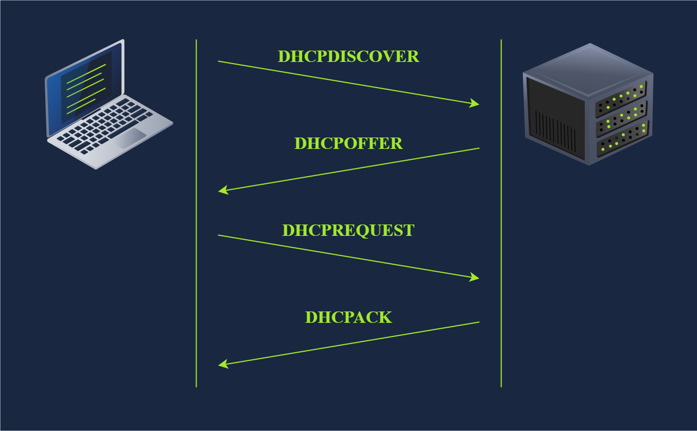
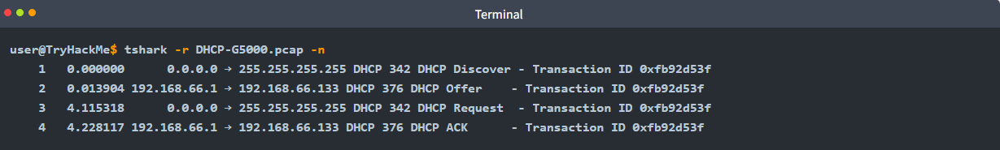
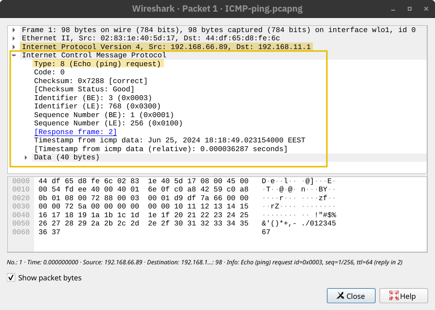

## 9.1 DHCP : la configuration automatique

**DHCP** attribue automatiquement à une machine son adresse IP, son masque, sa passerelle et ses serveurs DNS, pour une durée limitée (le **bail**). L'échange suit quatre étapes, **DORA** (UDP 67 côté serveur, 68 côté client) :

| Étape | Message | Sens |
|---|---|---|
| **D**iscover | « Y a-t-il un serveur DHCP ? » | Client → broadcast |
| **O**ffer | « Je te propose 192.168.1.50 » | Serveur → client |
| **R**equest | « Je prends 192.168.1.50 » | Client → broadcast (les autres serveurs savent que leur offre est déclinée) |
| **A**cknowledge | « Elle est à toi pour 24 h » | Serveur → client |

Le client renouvelle son bail à mi-durée. Sans réponse d'un serveur DHCP, Windows s'attribue une adresse **APIPA** (`169.254.x.x`) : signe immédiat d'un problème DHCP.

> Un faux serveur DHCP sur le segment peut distribuer une passerelle ou un DNS malveillant ; le *DHCP snooping* des switchs n'autorise les offres que sur les ports des vrais serveurs.

## 9.2 ICMP : erreurs et diagnostic

**ICMP** (protocole IP n°1) sert aux équipements à signaler des erreurs et à échanger des informations d'état. Il n'a pas de ports.

| Type | Message | Signification |
|---|---|---|
| 8 / 0 | **Echo Request / Echo Reply** | Le ping |
| 3 | **Destination Unreachable** | Réseau, hôte ou port injoignable (code précisé), ou fragmentation nécessaire |
| 5 | **Redirect** | « Utilise plutôt cet autre routeur » |
| 11 | **Time Exceeded** | TTL arrivé à 0 (utilisé par traceroute) |
| 12 | **Parameter Problem** | En-tête invalide |
| 13 / 14 | Timestamp Request / Reply | Heure de l'équipement distant (historique) |

## 9.3 Ping

`ping` envoie des **Echo Request** (type 8) et attend des **Echo Reply** (type 0). Il vérifie la joignabilité et mesure le temps d'aller-retour (RTT). Une absence de réponse ne prouve pas que la machine est éteinte : beaucoup de pare-feu bloquent ICMP.

## 9.4 Traceroute

`traceroute` (Linux) / `tracert` (Windows) découvre le chemin vers une cible en jouant sur le **TTL** : paquets avec TTL = 1, puis 2, puis 3… Chaque routeur qui ramène le TTL à 0 renvoie un *Time Exceeded* et révèle ainsi son adresse. `tracert` utilise des Echo Request ICMP ; `traceroute` sous Linux envoie par défaut des datagrammes UDP.

---
