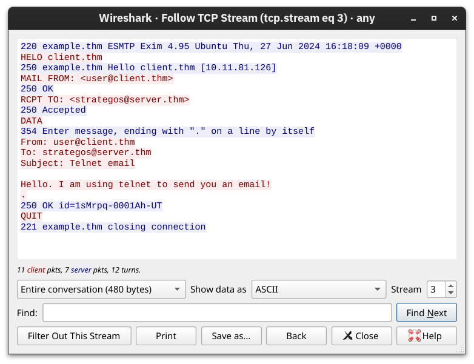
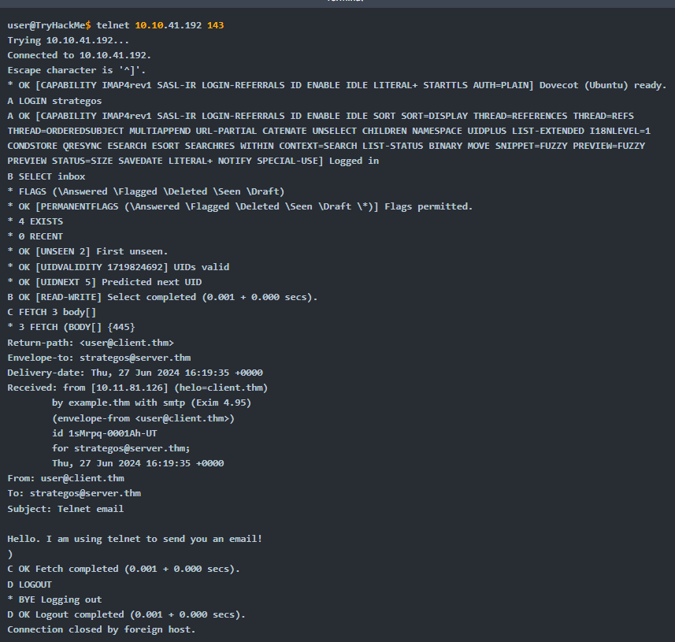
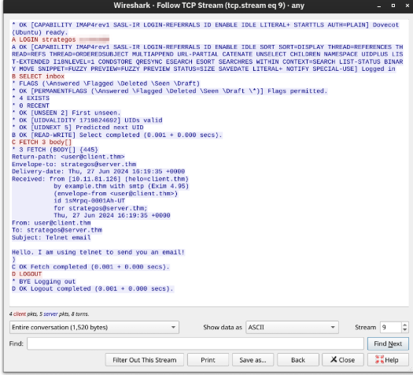

## 12.1 Les acteurs

```text
Expéditeur                                                    Destinataire
  MUA ──SMTP (587)──▶ MSA/MTA ──SMTP (25)──▶ MTA/MDA ◀──IMAP (993) / POP3 (995)── MUA
 (client)            (serveur d'envoi)       (serveur du destinataire)            (client)
```


| Composant | Rôle |
|---|---|
| **MUA** (*Mail User Agent*) | Le client de messagerie (Outlook, Thunderbird, webmail) |
| **MSA** (*Mail Submission Agent*) | Reçoit le message du client, le vérifie (authentification) |
| **MTA** (*Mail Transfer Agent*) | Achemine le message vers le MTA du destinataire (via l'enregistrement MX) |
| **MDA** (*Mail Delivery Agent*) | Dépose le message dans la boîte du destinataire |

On distingue l'envoi (**SMTP**) de la réception (**POP3**, **IMAP**).

## 12.2 SMTP : envoyer

SMTP transfère le message du client vers le serveur, puis de serveur en serveur. Un dialogue type :

```text
EHLO client.example.com        ← présentation
MAIL FROM:<alice@example.com>  ← expéditeur
RCPT TO:<bob@example.org>      ← destinataire
DATA                           ← début du contenu
Subject: Réunion
(corps du message)
.                              ← un point seul : fin du message
QUIT
```




| Port | Usage |
|---|---|
| 25 | Serveur à serveur (relais entre MTA) |
| 587 | Soumission depuis un client, avec authentification et STARTTLS |
| 465 | SMTP sur TLS implicite (SMTPS) |

> SMTP ne vérifie pas l'expéditeur annoncé : c'est le rôle de **SPF**, **DKIM** et **DMARC**, publiés dans le DNS (fiche notion dédiée).

## 12.3 POP3 : télécharger

POP3 (port 110, **995** en TLS) télécharge les messages sur l'appareil puis, par défaut, les supprime du serveur. Simple, mais inadapté à plusieurs appareils.

| Commande | Rôle |
|---|---|
| `USER` / `PASS` | Identifiant et mot de passe |
| `STAT` | Nombre de messages et taille totale |
| `LIST` | Liste des messages |
| `RETR <n>` | Télécharger le message n |
| `DELE <n>` | Marquer pour suppression |
| `QUIT` | Fermer en appliquant les suppressions |


## 12.4 IMAP : synchroniser

IMAP (port 143, **993** en TLS) laisse les messages sur le serveur et synchronise l'état (lu, déplacé, supprimé) entre tous les appareils.

| Commande | Rôle |
|---|---|
| `LOGIN <user> <pass>` | Authentification |
| `SELECT <boîte>` | Choisir un dossier |
| `FETCH <n> body[]` | Récupérer un message (en-têtes et corps) |
| `MOVE` / `COPY` | Déplacer / copier des messages |
| `LOGOUT` | Se déconnecter |





| | POP3 | IMAP |
|---|---|---|
| Messages | Téléchargés, supprimés du serveur | Restent sur le serveur |
| Plusieurs appareils | Non adapté | Synchronisés |
| Stockage serveur | Minimal | Important |

Dans leur version d'origine, SMTP, POP3 et IMAP circulent **en clair**, identifiants compris : leurs variantes TLS sont traitées au Ch.15.

---
