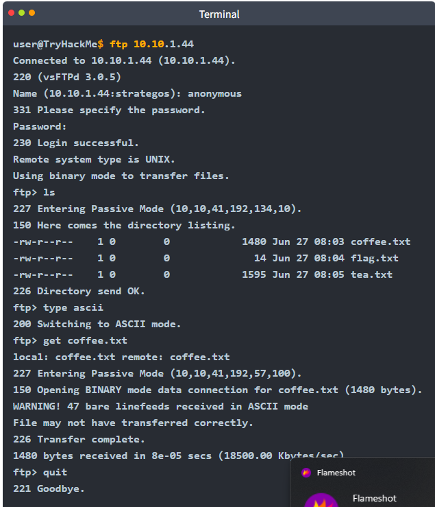

## 13.1 FTP

**FTP** transfère des fichiers en client-serveur avec deux canaux : un canal de **commande** (TCP 21) et un canal de **données**.

| Mode | Canal de données | Remarque |
|---|---|---|
| **Actif** | Le serveur se connecte au client (depuis le port 20) | Bloqué par la plupart des pare-feu et NAT côté client |
| **Passif** | Le client se connecte à un port que le serveur lui indique (commande `PASV`) | Le mode courant |

| Commande | Rôle |
|---|---|
| `USER` / `PASS` | Authentification (le compte `anonymous` existe sur certains serveurs) |
| `LIST` / `ls` | Lister |
| `RETR` / `get` | Télécharger |
| `STOR` / `put` | Envoyer |
| `TYPE A` / `TYPE I` | Mode texte (ASCII) / binaire |

Dans Wireshark, les commandes du client apparaissent en rouge et les réponses du serveur en bleu — identifiants compris, puisque FTP est en clair :

## 13.2 SMB

**SMB** (*Server Message Block*, TCP **445**, et 139 en héritage NetBIOS) est le protocole Windows de partage de fichiers et d'imprimantes, qui transporte aussi de l'authentification et de nombreuses opérations d'administration. SMBv1 est à désactiver ; SMBv3 apporte le chiffrement (cours *Windows en profondeur*, ch.15).

## 13.3 VoIP et SIP

La **VoIP** transporte la voix et la vidéo sur IP. **SIP** est le protocole de **signalisation** le plus répandu (devant H.323) : il ouvre, modifie et termine les sessions ; la voix elle-même circule à part, en RTP sur UDP.

| Port | Usage |
|---|---|
| 5060 (UDP/TCP) | SIP |
| 5061 (TCP) | SIP sur TLS |
| 1720 (TCP) | H.323 |
| Plage UDP dynamique | RTP (le flux audio/vidéo) |

| Méthode SIP | Rôle |
|---|---|
| `INVITE` | Ouvrir une session (un appel) |
| `ACK` | Confirmer un INVITE |
| `BYE` | Terminer la session |
| `CANCEL` | Annuler un INVITE en attente |
| `REGISTER` | Enregistrer un poste auprès du serveur SIP |
| `OPTIONS` | Interroger les capacités d'un serveur ou d'un poste |

Côté sécurité : les réponses du serveur SIP peuvent révéler quels comptes existent, et les fichiers de configuration des téléphones Cisco (`SEPxxxx.cnf`, servis en TFTP) contiennent modèle, firmware et paramètres réseau — à ne pas laisser accessibles à tous.

---
