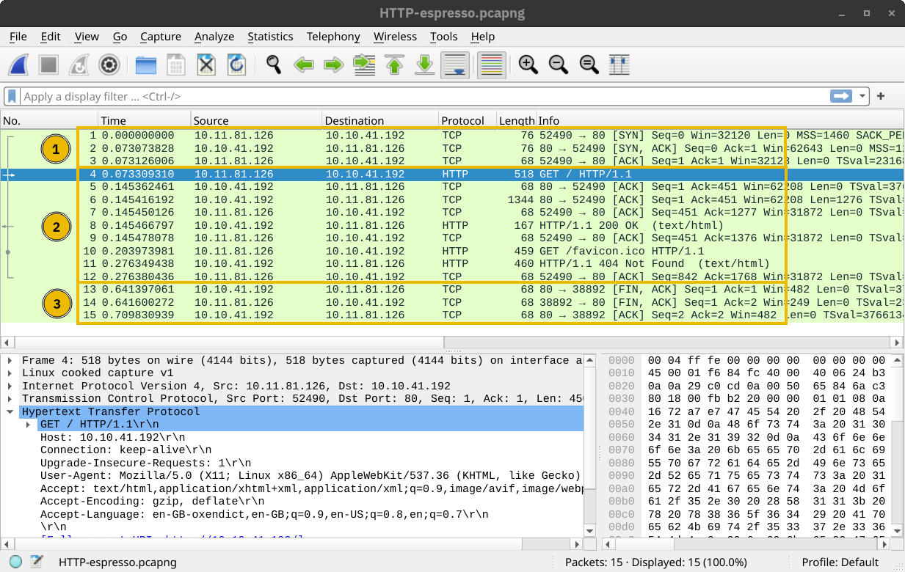
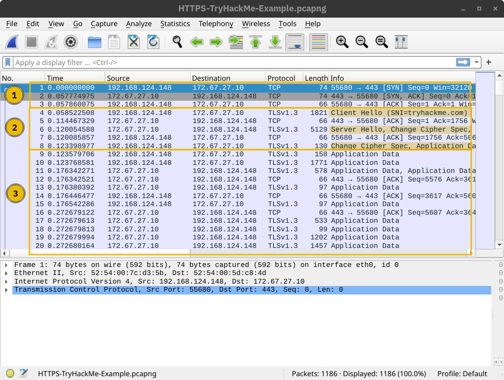

## 14.1 Ce qu'apporte TLS

**TLS** (*Transport Layer Security*, successeur de SSL, aujourd'hui en versions 1.2 et 1.3) établit une connexion sécurisée entre un client et un serveur sur un réseau non sûr. Il garantit trois choses :

| Propriété | Comment |
|---|---|
| **Confidentialité** | Les données sont chiffrées (AES, ChaCha20) |
| **Authentification** | Le serveur prouve son identité par un **certificat** (et le client aussi, en option) |
| **Intégrité** | Toute altération en route est détectée |

**HTTPS** n'est rien d'autre que HTTP transporté dans TLS (port 443). Même principe pour SMTPS, IMAPS, POP3S, LDAPS…

## 14.2 Les certificats et les autorités

Un certificat **X.509** lie une clé publique à une identité (un nom de domaine), et il est signé par une **autorité de certification** (CA) :

```text
1. L'administrateur génère une paire de clés et une demande de certificat (CSR)
2. Il soumet la CSR à une autorité de certification (CA)
3. La CA vérifie la demande (au minimum, le contrôle du domaine) et signe le certificat
4. Le serveur présente ce certificat ; le client vérifie la signature grâce aux certificats
   des CA de confiance déjà installés dans son système ou son navigateur
```


Le client vérifie que le certificat est **signé par une CA de confiance**, qu'il correspond **au nom contacté**, qu'il n'est **ni expiré ni révoqué**. Un certificat **auto-signé** chiffre aussi bien, mais ne prouve rien de l'identité du serveur, faute de tiers de confiance. Let's Encrypt délivre gratuitement des certificats de domaine.

## 14.3 Pourquoi un échange hybride

Le chiffrement **asymétrique** (paire clé publique / clé privée) permet d'échanger un secret avec un inconnu, mais il est lent. Le chiffrement **symétrique** (une seule clé partagée) est rapide, mais suppose que les deux côtés aient déjà la clé. TLS combine les deux : l'asymétrique sert seulement à établir une clé symétrique, puis tout le reste est chiffré en symétrique.

> **L'image du cadenas.** La banque distribue des cadenas ouverts (sa clé publique) ; elle seule possède la clé qui les rouvre (sa clé privée). Ton navigateur crée un secret, l'enferme dans une boîte fermée par le cadenas de la banque et l'envoie. Les espions voient passer un cadenas ouvert puis une boîte fermée : rien d'exploitable. La banque ouvre la boîte avec sa clé privée. Vous avez désormais le même secret et passez au chiffrement symétrique, beaucoup plus rapide. *L'asymétrique est le camion blindé qui transporte la clé ; le symétrique est la voiture de course qu'on utilise ensuite.*

En TLS moderne (1.3), la clé de session n'est plus transportée chiffrée par la clé publique du serveur : elle est **calculée des deux côtés** par un échange **Diffie-Hellman éphémère** (ECDHE), et le certificat sert à authentifier cet échange. Avantage : la **confidentialité persistante** (*forward secrecy*) — voler plus tard la clé privée du serveur ne permet pas de déchiffrer les sessions enregistrées.

## 14.4 Le handshake TLS

| Étape | Message | Contenu |
|---|---|---|
| 1 | **ClientHello** | Versions TLS et suites de chiffrement supportées, nombre aléatoire client, (TLS 1.3) part de clé Diffie-Hellman |
| 2 | **ServerHello** | Version et suite choisies, nombre aléatoire serveur, part de clé |
| 3 | **Certificate** | Certificat X.509 du serveur (et chaîne) |
| 4 | Vérification | Le client contrôle signature, nom, validité, révocation |
| 5 | Dérivation des clés | Les deux côtés calculent les mêmes clés de session à partir des aléas et de l'échange de clés — elles ne circulent jamais |
| 6 | **Finished** | Chaque côté prouve, chiffré, que le handshake n'a pas été altéré |

Ensuite, les données applicatives circulent chiffrées dans des *records* TLS.

## 14.5 HTTP et HTTPS dans une capture

En **HTTP**, la capture montre trois temps lisibles : le handshake TCP, l'échange HTTP en clair, la fermeture TCP.



En **HTTPS**, après le handshake TCP vient la négociation TLS, puis des paquets *Application Data* dont le contenu est opaque — Wireshark ne sait même pas que c'est du HTTP.




Pour lire le contenu, il faut les clés de session : sur sa propre machine, la variable `SSLKEYLOGFILE` fait écrire au navigateur ses clés dans un fichier que Wireshark sait charger. C'est aussi le principe des proxys d'**inspection TLS** en entreprise, qui déchiffrent puis rechiffrent le trafic avec un certificat interne de confiance.

---
