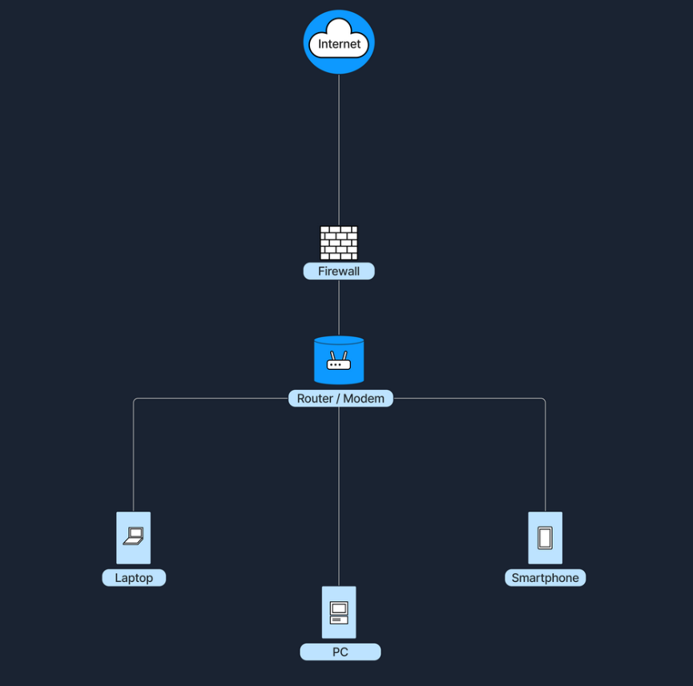
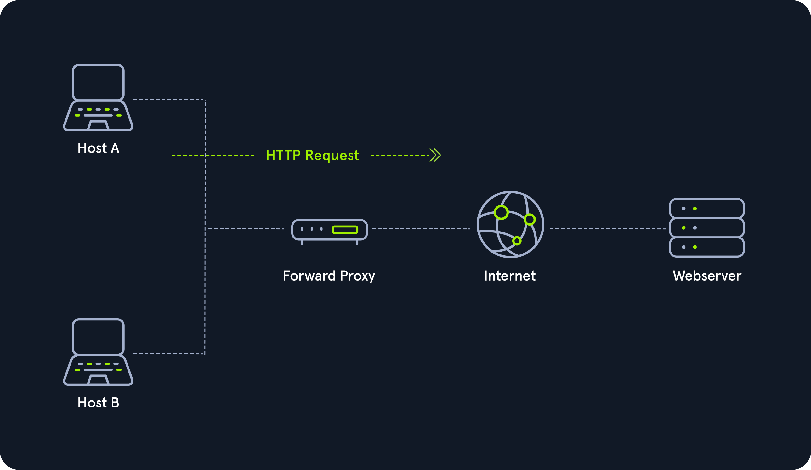
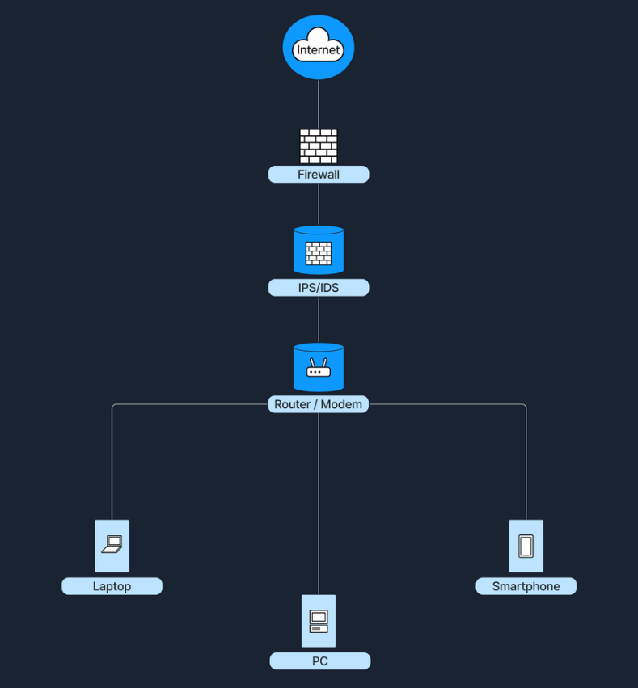
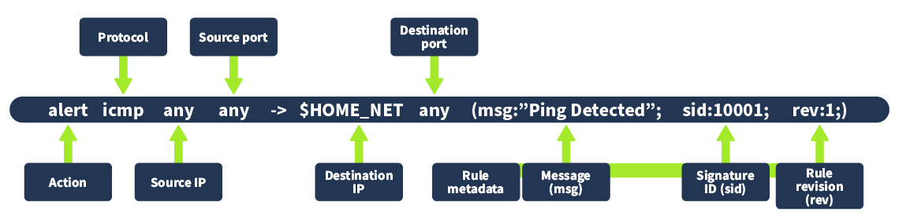

## 17.1 Les pare-feu

Un **pare-feu** filtre le trafic entrant et sortant selon des règles.

| Type | Couches | Principe | Exemple |
|---|---|---|---|
| **Sans état** (*stateless*) | 3-4 | Chaque paquet est jugé isolément sur des règles fixes | ACL de routeur |
| **Avec état** (*stateful*) | 3-4 | Suit les connexions dans une **table d'états** : une réponse est autorisée parce qu'elle correspond à une connexion sortante établie | Pare-feu d'entreprise classique, pare-feu Windows |
| **Proxy / applicatif** | 7 | Intermédiaire qui termine la connexion, inspecte le contenu et masque l'IP du client | Proxy web filtrant les requêtes malveillantes |
| **NGFW** (*Next-Generation Firewall*) | 3-7 | Stateful + inspection approfondie (DPI), prévention d'intrusion, contrôle des applications, réputation, inspection TLS | Palo Alto, Fortinet, Stormshield |

**Une règle** combine source, destination, port, protocole, action et direction :

| Élément | Valeurs |
|---|---|
| **Action** | Autoriser (*allow*), refuser (*deny / drop / reject*), rediriger (*forward*) |
| **Direction** | **Entrant** (autoriser HTTP vers le serveur web), **sortant** (bloquer SMTP sortant sauf depuis le serveur de messagerie), **redirection** (envoyer le HTTP entrant vers le serveur web interne) |



Les règles sont évaluées **dans l'ordre**, la première qui correspond s'applique, et la dernière doit être un refus par défaut (*deny all*). Bonne pratique : n'autoriser que le nécessaire, sources restreintes comprises, et journaliser les refus.

## 17.2 Les proxys

Un **proxy** est un intermédiaire de couche 7 placé au milieu d'une connexion.

| Type | Filtre | Rôle |
|---|---|---|
| **Proxy direct** (*forward proxy*) | Les requêtes **sortantes** des clients | Filtrage web, journalisation, cache, inspection TLS |
| **Reverse proxy** | Les requêtes **entrantes** vers des serveurs | Publication de services internes, répartition de charge, terminaison TLS, WAF |




Un proxy **explicite** est configuré sur le poste (paramètres, fichier PAC) ; un proxy **transparent** intercepte le trafic sans configuration côté client.

## 17.3 IDS et IPS

Le pare-feu décide de ce qui passe ; il faut aussi **détecter** ce qui, une fois passé, est malveillant.

| | **IDS** (*Intrusion Detection System*) | **IPS** (*Intrusion Prevention System*) |
|---|---|---|
| Action | Observe et **alerte** | Observe et **bloque** en temps réel |
| Position | En copie du trafic (port miroir, TAP) | En coupure, sur le chemin |
| Risque | Laisser passer | Bloquer à tort (faux positif) |

| Détection | Principe | Force / limite |
|---|---|---|
| **Par signatures** | Comparaison avec une base de motifs d'attaques connues | Précise sur le connu, aveugle au nouveau |
| **Par anomalies** | Apprentissage du comportement normal, alerte sur les écarts | Détecte l'inconnu, plus de faux positifs |

| Emplacement | Voit |
|---|---|
| **HIDS** | Un hôte (journaux, fichiers, processus) |
| **NIDS** | Le trafic d'un segment ou de tout le réseau |



## 17.4 Snort : une règle de détection

**Snort** (comme Suricata) est un IDS/IPS réseau à base de règles :



Exemple : alerter dès qu'on « pingue » la boucle locale. Règle ajoutée dans `/etc/snort/rules/local.rules` :

```text
alert icmp any any -> 127.0.0.1 any (msg:"Loopback Ping Detected"; sid:10003; rev:1;)
```


Lancement de Snort sur l'interface concernée (vérifier son nom, pas forcément `lo`) :

```bash
sudo snort -q -l /var/log/snort -i lo -A console -c /etc/snort/snort.conf
```


---
