- Les **Windows Event Logs** enregistrent les événements générés par :
    - Windows ;
    - applications ;
    - services ;
    - drivers ;
    - mécanismes de sécurité.
## Stockage des Event Logs

Les journaux Windows sont généralement stockés dans :

```
C:\Windows\System32\winevt\Logs\
```

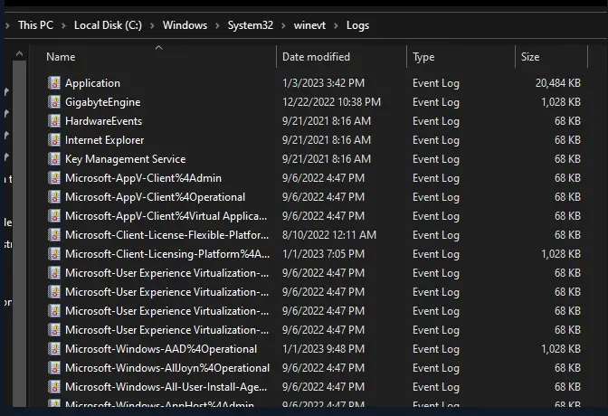

Extension :

```
.evtx
```


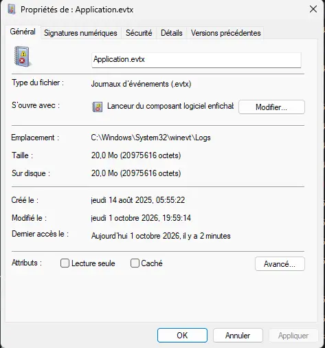

- Les fichiers `.evtx` utilisent le format **Windows Event Log**.
- Ils ne sont pas destinés à être lus directement avec un éditeur texte classique.

```
.evtx
→ Event Viewer / PowerShell / Forensic Tools
→ Human-readable Events
```


Outils possibles :

- Event Viewer (eventvwr.msc) ;
- PowerShell ;
- `wevtutil` ;
- outils DFIR / SIEM.
## Windows Logs
Les journaux Windows principaux sont :

- Application : Liés aux app installées 
- Security : Liés aux co/déco de session, aux co RDP, aux services utilisés, aux tâches créées...
- System : Liés aux états du matériel, pilotes...
- Setup : Lors de l'installation de l'OS. Sur DC, ce journal enregistrera les évents liés à l'AD
- Forwarded Events : Journaux transférés depuis d'autres ordinateurs du même réseau.

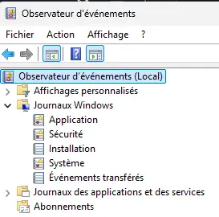
### Application

- Contient les événements générés par les applications.
- Exemples :
    - crash ;
    - erreur applicative ;
    - problème de base de données ;
    - événement provenant d’un logiciel installé.

```
Application
→ Application Events
```

### Security

- Contient les événements liés aux **audits de sécurité**.
- Dépend fortement des **Audit Policies** configurées.

Exemples :

- logon / logoff ;
- échecs d’authentification ;
- account management ;
- privilege usage ;
- object access ;
- process creation lorsque l’audit correspondant est activé.

```
Security
→ Authentication
→ Authorization
→ Audit
```


Quelques Event IDs courants :

```
4624 → Successful Logon
4625 → Failed Logon
4688 → Process Creation
4720 → User Account Created
1102 → Audit Log Cleared
```


> ⚠️ Tous les événements de sécurité ne sont pas présents automatiquement : la visibilité dépend des **Audit Policies / Advanced Audit Policies** activées.

### System

- Contient principalement les événements générés par Windows et ses composants système.

Exemples :

- drivers ;
- services ;
- hardware ;
- boot ;
- erreurs système.

```
System
→ OS / Driver / Service Events
```


Exemple notable :

```
7045
→ New Service Installed
```

### Setup

- Contient les événements liés à :
    - installation de Windows ;
    - configuration du système ;
    - installation de composants / rôles.

Sur un Domain Controller, il peut également contenir certains événements liés à l’installation/configuration d’Active Directory.
### Forwarded Events

- Contient les événements reçus depuis d’autres systèmes Windows.

```
Endpoint A ─┐
Endpoint B ─┼→ Windows Event Forwarding → Collector
Server C ───┘
```


Utilisé notamment avec :

- **WEF — Windows Event Forwarding** ;
- **WEC — Windows Event Collector**.

-> Cela permet de centraliser les logs avant leur éventuelle ingestion dans un SIEM.
## Applications and Services Logs
En plus de `Windows Logs`, Windows possède :

```
Applications and Services Logs
```

- Contient des journaux beaucoup plus spécifiques à :
    - composants Windows ;
    - applications ;
    - services.

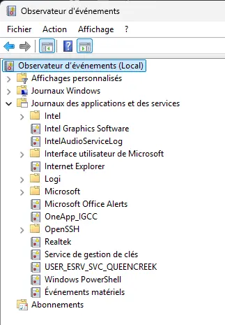
Chemin fréquent :

```
Applications and Services Logs
└─ Microsoft
   └─ Windows
```


Exemples :

```
Microsoft-Windows-PowerShell/Operational
Microsoft-Windows-Windows Defender/Operational
Microsoft-Windows-TerminalServices-LocalSessionManager/Operational
Microsoft-Windows-TaskScheduler/Operational
```


Ces logs sont particulièrement utiles pour le **SOC / DFIR**, car ils fournissent souvent davantage de contexte que les journaux Windows généraux.
## Event ID

- Un **Event ID** est un identifiant numérique permettant d’identifier un type d’événement généré par un provider.

Exemple :
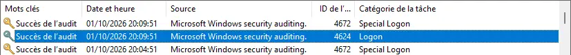

```
4624
→ Successful Logon
```


Un événement contient généralement plusieurs champs :

```
Event ID
Provider / Source
Timestamp
Computer
User
Level
Event Data
```


> ⚠️ Un Event ID n’est pas forcément **globalement unique dans tout Windows**. Sa signification doit être interprétée avec son **Provider / Source et son journal**.

Donc :

```
Event ID alone
≠ Complete Context
```


Exemple :

```
4624
+
Username
+
Logon Type
+
Source IP
+
Hostname
+
Timestamp
→ Useful Security Context
```

## Event Levels
Les événements peuvent être classés selon leur niveau.

| Level           | Signification                                                                                                                        |
| --------------- | ------------------------------------------------------------------------------------------------------------------------------------ |
| **Critical**    | Indique un problème important dans une application ou un système nécessitant une attention urgente.                                  |
| **Error**       | Erreur ayant entraîné une perte de fonctionnalité                                                                                    |
| **Warning**     | Ce type d'événement signifie qu'il y a un problème mineur qui pourrait entraîner des problèmes plus importants à l'avenir.           |
| **Information** | Ce type d'événement signifie qu'une opération s'est terminée avec succès et qu'une description générale de celle-ci est enregistrée. |
| **Verbose**     | informations détaillées de diagnostic / progression                                                                                  |

> Le niveau indique la **nature / gravité opérationnelle du message**, pas nécessairement sa criticité cyber.

Par exemple :

```
Information Event
→ peut malgré tout être extrêmement intéressant en investigation
```

## Security Keywords
Dans le journal `Security`, on rencontre notamment :
### Audit Success

- Une opération soumise à audit a réussi.

Exemple :

```
Successful Logon
→ Audit Success
```

### Audit Failure

- Une opération soumise à audit a échoué.

Exemple :

```
Failed Logon
→ Audit Failure
```

> `Audit Failure` ne signifie pas forcément « attaque détectée » : cela signifie simplement que **l’action auditée a échoué**.
#### Exemple : authentification Windows

```
User attempts login
        ↓
Authentication
        ↓
Success?
├─ Yes → Event ID 4624
└─ No  → Event ID 4625
```

Pour l’analyse SOC, on ne cherche donc pas uniquement :

```
4624 / 4625
```

mais plutôt :

```
Who?
Where from?
Which host?
Which Logon Type?
When?
How often?
What happened next?
```

#### Utilité SOC / Incident Response
Les Windows Event Logs permettent notamment de reconstruire :

```
Initial Access
→ Execution
→ Persistence
→ Privilege Escalation
→ Credential Access
→ Lateral Movement
→ Impact
```

Exemples :

```
4624 → Logon
4688 → Process Creation
7045 → Service Installed
4698 → Scheduled Task Created
4720 → Account Created
1102 → Security Log Cleared
```


Mais :

```
Event ID
→ Indicator / Artifact
≠ preuve automatique d'activité malveillante
```


La valeur des Event Logs vient surtout de leur **corrélation dans le temps avec les utilisateurs, processus, machines, adresses IP et autres sources de télémétrie**.

## Analyse des journaux d’événements Windows
Trois outils natifs permettent principalement de consulter et analyser les **Windows Event Logs** :

```text
Event Viewer
→ GUI

wevtutil
→ CLI

Get-WinEvent
→ PowerShell
```

## Event Viewer — Observateur d’événements

- Interface graphique native de Windows pour :
  - consulter les Event Logs ;
  - examiner le détail d’un événement ;
  - filtrer les événements ;
  - exporter les résultats.

Lancement :

```text
eventvwr.msc
```


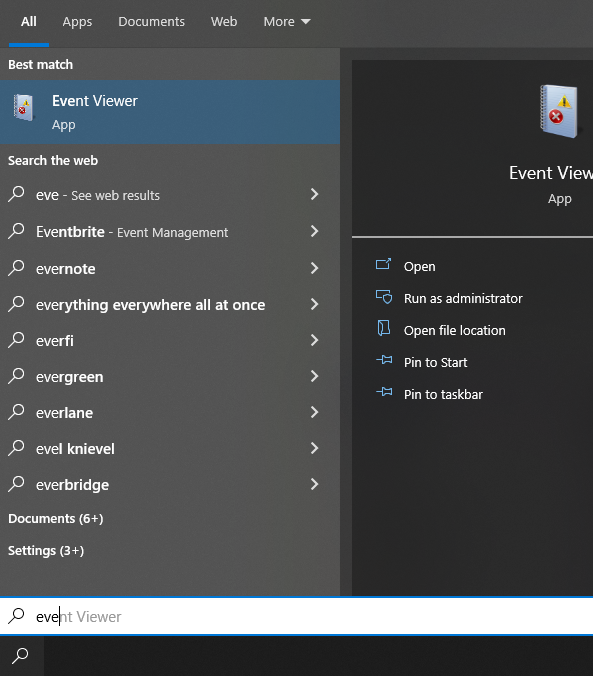

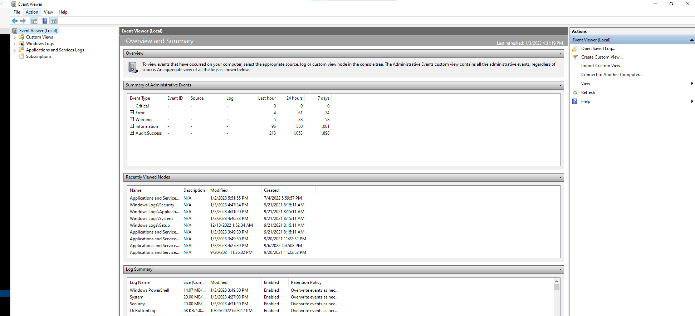

### Organisation
Dans `Windows Logs`, on retrouve notamment :

```text
Application
Security
System
Setup
Forwarded Events
```

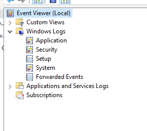

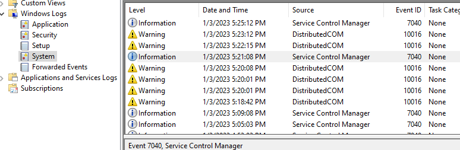
Lorsqu’un journal est sélectionné, le panneau central affiche notamment :

- `Level` ;
- `Date and Time` ;
- `Source / Provider` ;
- `Event ID` ;
- `Task Category`.

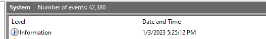
## Détails d’un événement

En ouvrant un événement, on peut retrouver :

```text
Event ID
Level
Provider / Source
Logged Time
Computer
User
Task Category
Message
Event Data
```

Deux vues principales sont disponibles :

### General
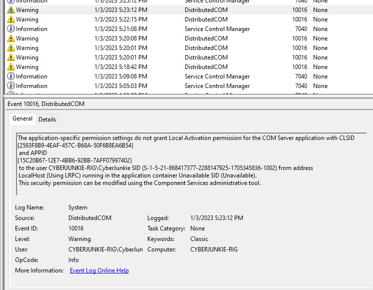

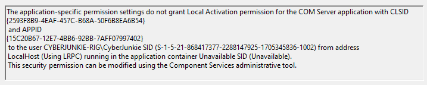

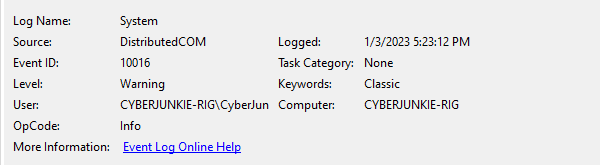

- Vue lisible présentant le message et les principaux attributs.

### Details
Permet d’afficher :

```text
Friendly View
ou
XML View
```

La vue XML est particulièrement intéressante pour l’analyse technique car elle expose directement les champs structurés de l’événement.

```xml
<Event>
  <System>...</System>
  <EventData>...</EventData>
</Event>
```


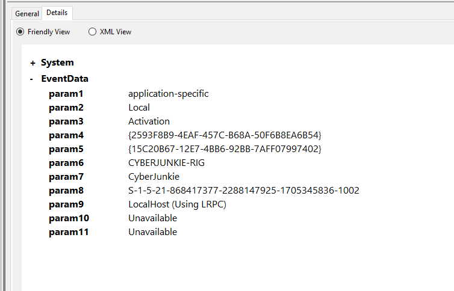
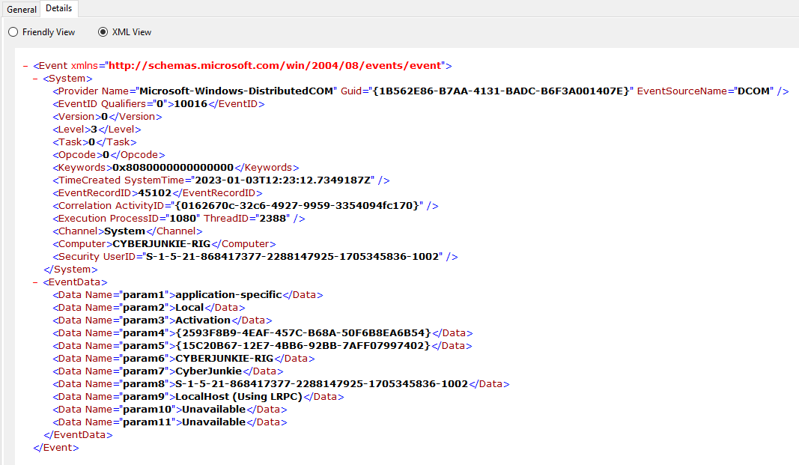
## Filtrage dans Event Viewer

### Filter Current Log
Permet de filtrer selon plusieurs critères :

- Event ID ;
- niveau ;
- source ;
- date / heure ;
- utilisateur ;
- autres attributs.

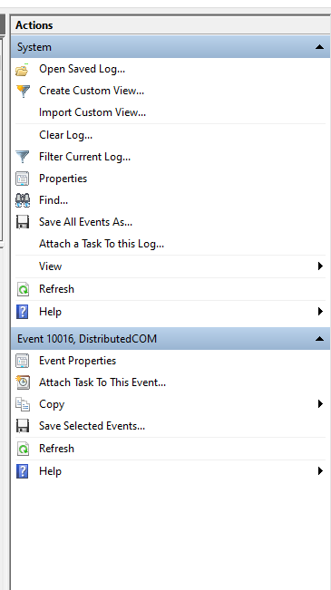

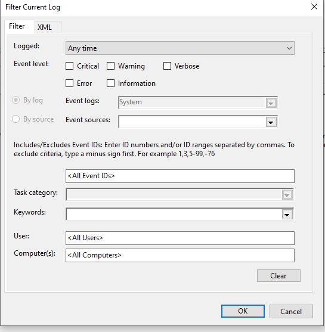
#### Filtrer par Event ID
Exemple :

```text
7040
```


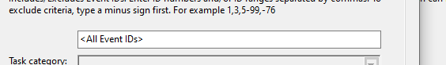

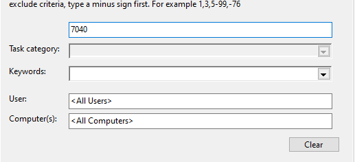

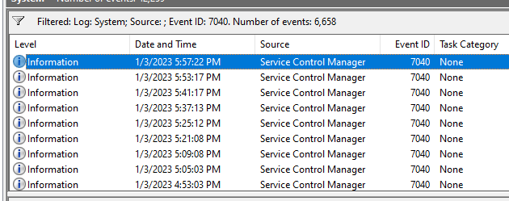

→ affiche uniquement les événements portant cet ID.

Plusieurs Event IDs peuvent être fournis :

```text
7040,10016
```


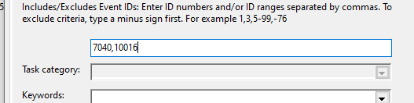
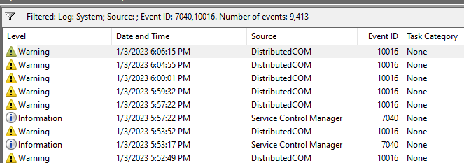
### Filtrage temporel
Les filtres peuvent être combinés avec une période.
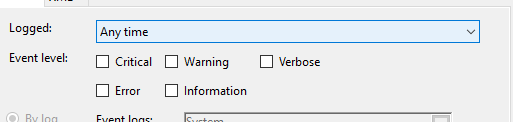

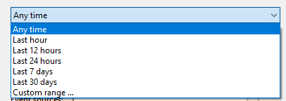

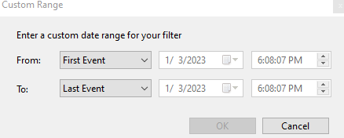

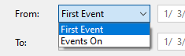

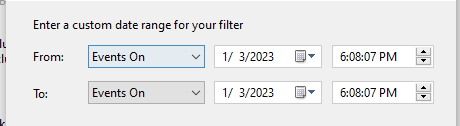

Exemple :
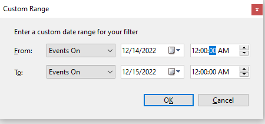

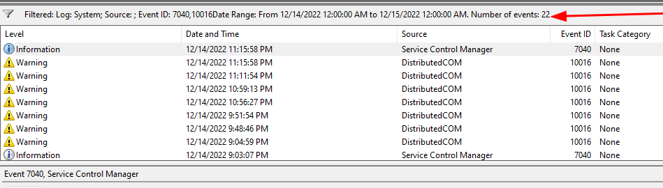
Très utile en Incident Response lorsqu’une fenêtre temporelle de compromission est déjà connue.
## Effacer un filtre vs effacer un journal
Deux opérations à ne pas confondre :

```text
Clear Filter
→ retire uniquement le filtre d'affichage

Clear Log
→ supprime les événements du journal
```


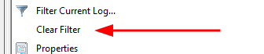

> ⚠️ `Clear Log` peut supprimer une source de preuves importante lors d’une investigation.

Un effacement du journal `Security` peut lui-même laisser une trace, notamment :
## Export des événements
Event Viewer permet d’enregistrer les événements sélectionnés ou affichés.

Si un filtre est appliqué :

```text
Full Log
→ Filter
→ Displayed Events
→ Save
```


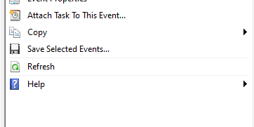
→ seuls les événements correspondant au filtre peuvent être exportés selon l’action choisie.

Format typique :

```text
.evtx
```


Cela permet de conserver les événements pour :

- investigation ;
- forensic analysis ;
- partage ;
- archivage.

## `wevtutil`

`wevtutil.exe` est un outil CLI natif permettant de gérer les Windows Event Logs.

Fonctions principales :

- lister les journaux ;
- lire les événements ;
- exporter les logs ;
- récupérer les informations de configuration ;
- effacer un journal.

### Aide

```cmd
wevtutil.exe /?
```

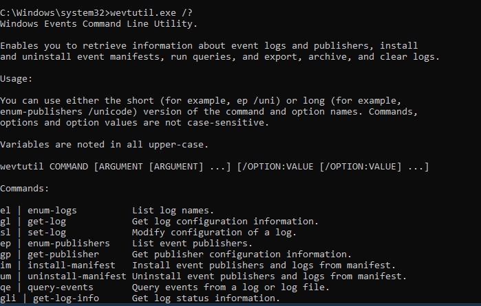
### Lister les journaux

```cmd
wevtutil.exe el
```


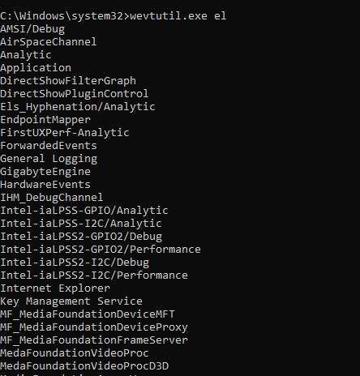

`el` :

```text
enum-logs
→ liste les journaux disponibles
```

### Lire des événements

Exemple :

```cmd
wevtutil.exe qe System /c:3 /rd:true /f:text
```


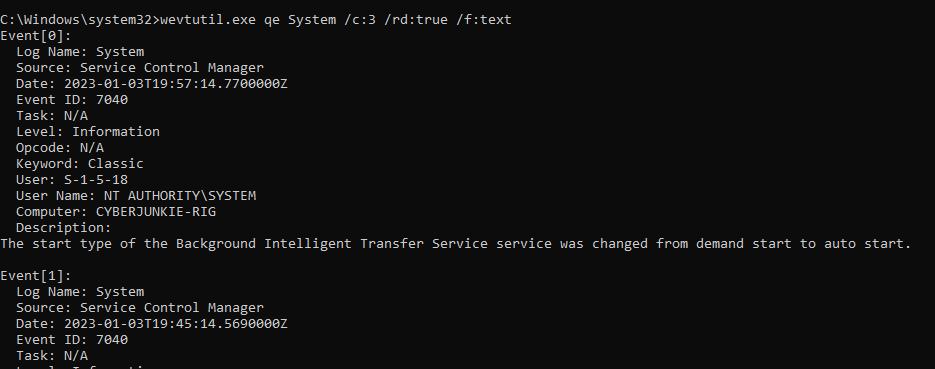

Décomposition :

```text
qe System
→ Query Events du journal System

/c:3
→ retourne 3 événements

/rd:true
→ ordre inverse, les événements récents en premier

/f:text
→ sortie au format texte
```


Conceptuellement :

```text
System Log
→ Query
→ Last 3 Events
→ Text Output
```


---

## `Get-WinEvent`

- Cmdlet PowerShell destiné à consulter les Windows Event Logs.
- Peut fonctionner sur :
  - machine locale ;
  - machine distante.
- Permet des requêtes beaucoup plus avancées grâce notamment à :
  - `FilterHashtable` ;
  - XPath ;
  - XML queries ;
  - pipeline PowerShell.
### Lister les journaux

```powershell
Get-WinEvent -ListLog *
```


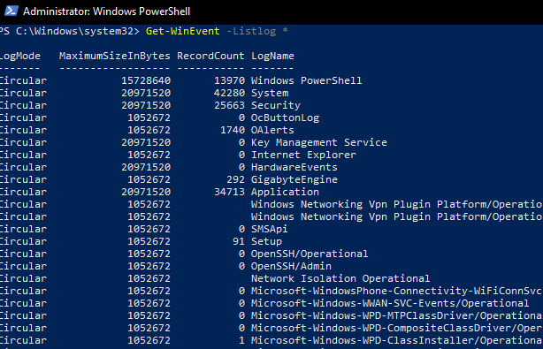

Équivalent conceptuel de :

```cmd
wevtutil el
```

## Lire un journal
Exemple :

```powershell
Get-WinEvent -LogName System
```


→ retourne les événements du journal `System`.
## Filtrer selon le Provider
Exemple du cours :

```powershell
Get-WinEvent -LogName System |
Where-Object {$_.ProviderName -match 'Service Control Manager'}
```


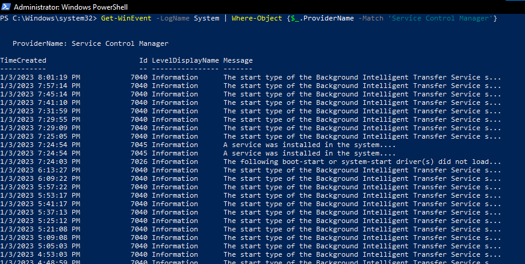

Workflow :

```text
System Events
→ PowerShell Pipeline
→ ProviderName = Service Control Manager
→ Matching Events
```


Le résultat de ton screenshot montre justement des événements du provider :

```text
Service Control Manager
```


avec notamment :

```text
7040
7045
7026
```

### ProviderName
Le `ProviderName` représente le composant ayant généré l’événement.

Exemple :

```text
ProviderName:
Service Control Manager
```


Il permet d’ajouter du contexte à l’Event ID :

```text
Event ID
+
Provider
→ Meaning
```


## Service Control Manager
Le **Service Control Manager — SCM** gère les services Windows.

Certains Event IDs visibles dans ton screenshot :

### Event ID 7040

- Changement du **Start Type** d’un service.

Exemple :

```text
Background Intelligent Transfer Service

Automatic
→ Manual
```


En investigation, un changement inattendu du mode de démarrage d’un service peut être intéressant.

---

### Event ID 7045

```text
A service was installed in the system
```


→ création / installation d’un nouveau service.

Particulièrement intéressant pour le SOC car les attaquants peuvent créer des services pour :

- persistence ;
- execution ;
- privilege escalation ;
- lateral movement.

```text
New Service
→ Legitimate?
ou
→ Suspicious Persistence / Execution?
```


---

### Event ID 7026

- Signale qu’un ou plusieurs drivers `boot-start` ou `system-start` n’ont pas pu être chargés.

Ce type d’événement relève davantage du troubleshooting, mais peut également fournir du contexte lors d’une investigation.

---

## Filtrer par Event ID avec PowerShell

Même si le cours commence avec `Where-Object`, `Get-WinEvent` permet de filtrer directement à la source.

Exemple :

```powershell
Get-WinEvent -FilterHashtable @{
    LogName = 'System'
    Id      = 7045
}
```


```text
FilterHashtable
→ filtering performed during event retrieval
```


Cela est généralement préférable à :

```powershell
Get-WinEvent -LogName System |
Where-Object {$_.Id -eq 7045}
```


car `Where-Object` récupère d’abord les événements avant de les filtrer.

```text
Where-Object
System Log → Retrieve → Filter

FilterHashtable
System Log → Filter → Retrieve
```


→ sur de gros journaux, `FilterHashtable` est généralement beaucoup plus efficace.

---

## Filtrer par Provider

Exemple équivalent :

```powershell
Get-WinEvent -FilterHashtable @{
    LogName      = 'System'
    ProviderName = 'Service Control Manager'
}
```


---

## Filtrer plusieurs Event IDs

```powershell
Get-WinEvent -FilterHashtable @{
    LogName = 'System'
    Id      = 7040,7045
}
```


---

## Filtrer selon une période

```powershell
Get-WinEvent -FilterHashtable @{
    LogName   = 'System'
    StartTime = (Get-Date).AddDays(-1)
}
```


Conceptuellement :

```text
System
+
Last 24 Hours
+
Relevant Event IDs
→ Focused Investigation
```


---

## Event Viewer vs `wevtutil` vs `Get-WinEvent`

| Outil | Interface | Usage principal |
|---|---|---|
| **Event Viewer** | GUI | Analyse manuelle / exploration |
| **wevtutil** | CMD | Gestion et requêtes CLI |
| **Get-WinEvent** | PowerShell | Analyse, filtrage et automatisation |

```text
Event Viewer
→ rapide pour explorer visuellement

wevtutil
→ administration CLI

Get-WinEvent
→ scripting / hunting / analyse avancée
```


---

## Approche SOC

Pour une investigation, on cherchera rarement simplement :

```text
"Montre-moi tous les logs"
```


mais plutôt :

```text
Relevant Log
+
Event ID
+
Provider
+
Time Window
+
Host
+
User
→ Relevant Events
```


Exemple :

```text
System
+
Service Control Manager
+
7045
+
Incident Time Window
→ Newly Installed Services
```


Puis :

```text
New Service
→ Service Name
→ Executable Path
→ Account
→ Timestamp
→ Correlate with Process / Network / Authentication Logs
```


La puissance de ces outils vient donc moins de la simple lecture d’un `.evtx` que de la capacité à **réduire rapidement des dizaines de milliers d’événements à ceux qui sont pertinents pour l’investigation**.

Source des captures : [Hack The Box Academy - Event Log Analysis](https://academy.hackthebox.com/app/module/387/section/4529)

## Journaux d’événements d’authentification

- Windows journalise les authentifications **réussies et échouées** dans le journal `Security`.
- Ces événements permettent notamment de détecter :
  - brute force ;
  - password spraying ;
  - compromission de compte ;
  - utilisation suspecte de credentials ;
  - connexions RDP ;
  - lateral movement.

```text
Authentication Attempt
        ↓
Windows Security Log
        ↓
Success / Failure
        ↓
Context + Correlation
        ↓
Legitimate / Suspicious
```


> Une succession d’échecs suivie d’un succès est un **signal intéressant**, mais pas une preuve suffisante de compromission sans contexte supplémentaire.

---

## Logon Types

- Le **Logon Type** indique **comment la session a été créée**.
- Il est essentiel pour interpréter correctement les événements `4624` et `4625`.

| Logon Type | Nom | Utilisation |
|---:|---|---|
| **2** | Interactive | connexion locale / physique |
| **3** | Network | accès réseau : SMB, partage, accès distant à une ressource |
| **4** | Batch | tâches planifiées / batch |
| **5** | Service | démarrage d’un service sous un compte |
| **7** | Unlock | déverrouillage d’une session |
| **8** | NetworkCleartext | authentification réseau avec credentials transmis à un package d’authentification sous une forme exploitable |
| **9** | NewCredentials | nouvelles credentials pour accès réseau, ex. `runas /netonly` |
| **10** | RemoteInteractive | RDP / Terminal Services |
| **11** | CachedInteractive | logon avec credentials de domaine mis en cache |

> Le cours parle de **9 types de logon**, mais Windows définit davantage de valeurs selon les versions et scénarios. Pour l’analyse SOC, les plus importants sont surtout `2`, `3`, `5`, `9`, `10` et `11`.

---

### Logon Type 2 — Interactive

```text
User
→ Physical / Local Login
→ Logon Type 2
```


- Connexion interactive directement sur la machine.
- Typiquement :
  - console locale ;
  - utilisateur devant le poste.


---

### Logon Type 3 — Network

```text
Remote System
→ Network Resource
→ Logon Type 3
```


Utilisé notamment pour :

- SMB ;
- accès à un partage ;
- certaines opérations d’administration distante ;
- communications authentifiées sur le réseau.

En investigation :

```text
4625
+
Logon Type 3
+
Many Hosts
→ Possible Lateral Movement / Password Guessing
```


---

### Logon Type 4 — Batch

- Utilisé pour les traitements non interactifs.

Exemple :

```text
Scheduled Task
→ User Account
→ Logon Type 4
```


---

### Logon Type 5 — Service

- Créé lorsqu’un service démarre sous un compte.

```text
Service
→ Service Account
→ Logon Type 5
```


- Très fréquent.
- Peut générer beaucoup de bruit dans les journaux.

> Le cours recommande de ne pas se focaliser sur le Type `5` lors d’une première recherche d’authentifications utilisateur, car les services en génèrent énormément. Il ne faut toutefois pas l’ignorer systématiquement : un **nouveau service malveillant** peut justement produire ce type d’événement.


---

### Logon Type 10 — RemoteInteractive

- Typique des connexions :

```text
RDP
Terminal Services
Remote Desktop
```


```text
Remote User
→ RDP
→ Target Host
→ Logon Type 10
```


Très utile pour détecter :

- accès RDP externe ;
- lateral movement ;
- utilisation de comptes privilégiés à distance.

---

## Event ID 4624 — Successful Logon

- Un logon Windows réussi génère généralement :

```text
Event ID 4624
→ Successful Logon
→ Audit Success
```


Pour l’analyse, regarder notamment :

- `Account Name` ;
- `Account Domain` ;
- `Logon Type` ;
- source IP ;
- workstation ;
- authentication package ;
- timestamp.

```text
4624
+
User
+
Logon Type
+
Source IP
+
Target Host
→ Authentication Context
```


---

## Event ID 4625 — Failed Logon

- Une tentative d’authentification échouée génère :

```text
Event ID 4625
→ Failed Logon
→ Audit Failure
```


Informations utiles :

- compte ciblé ;
- domaine ;
- Logon Type ;
- source IP ;
- Failure Reason ;
- Status / SubStatus.


---

### Analyse des échecs

Quelques échecs isolés peuvent correspondre à :

- typo ;
- ancien password ;
- service mal configuré ;
- credential expiré.

Mais :

```text
Many 4625
+
Short Time Window
+
Same Account
+
Same Source
→ Possible Brute Force
```


ou :

```text
Many 4625
+
Many Accounts
+
Same Source
→ Possible Password Spraying
```


#### Brute Force vs Password Spraying

```text
Brute Force
→ Many passwords
→ One / few accounts
```


```text
Password Spraying
→ One / few passwords
→ Many accounts
```


---

### Échec puis succès

Pattern particulièrement intéressant :

```text
4625
4625
4625
4625
4624
```


Peut indiquer :

- utilisateur ayant finalement saisi le bon password ;
- brute force réussi ;
- password spraying réussi ;
- credential compromise.

→ toujours corréler avec :

- source IP ;
- Logon Type ;
- heure ;
- user ;
- hostname ;
- comportement après authentification.

---

## Détection du lateral movement

Le Logon Type `3` peut être particulièrement utile lorsqu’un attaquant tente d’accéder à plusieurs systèmes.

Exemple :

```text
HOST-A
→ 4625 Type 3 → HOST-B
→ 4625 Type 3 → HOST-C
→ 4624 Type 3 → HOST-D
```


→ peut indiquer :

```text
Credential Guessing
→ Successful Authentication
→ Lateral Movement
```


Le cours souligne qu’une série de `4625` Type `3` sur plusieurs machines mérite une investigation approfondie.

---

## Authentification RDP

- **RDP — Remote Desktop Protocol** est largement utilisé pour :
  - administration ;
  - support ;
  - accès distant.
- Il est également fréquemment utilisé par les attaquants pour le **lateral movement**.

```text
Compromised HOST-A
→ RDP
→ HOST-B
→ RDP
→ HOST-C
```


L’analyse RDP nécessite de considérer :

```text
Source Host
+
Destination Host
```


---

## Logs côté machine cible RDP

### Event ID 4624 + Logon Type 10

Une authentification RDP réussie peut être identifiée via :

```text
Security Log
→ Event ID 4624
→ Logon Type 10
```


```text
4624 + Type 10
→ Remote Interactive Logon
```


---

## TerminalServices-RemoteConnectionManager

Windows dispose également de journaux RDP spécialisés :

```text
Applications and Services Logs
→ Microsoft
→ Windows
→ TerminalServices-RemoteConnectionManager
→ Operational
```


Ils contiennent moins de bruit que le journal `Security`.


---

### Event ID 1149

```text
Provider:
TerminalServices-RemoteConnectionManager

Event ID:
1149
```


- Signale qu’une **authentification RDP a réussi** au niveau du Remote Connection Manager.
- Peut notamment contenir :
  - username ;
  - domain ;
  - source IP.

```text
1149
→ User Authentication Succeeded
→ Source IP
→ Target Host
```


> `1149` est très utile, mais il vaut mieux le corréler avec `4624 Type 10` et les journaux `LocalSessionManager` pour confirmer la création réelle d’une session interactive RDP.


---

## Détecter un système source compromis

Exemple :

```text
HOST-B
receives RDP connection
from
192.168.18.8
```


Si `192.168.18.8 = HOST-A` et que cette activité se produit pendant la fenêtre de compromission :

```text
HOST-A
→ likely compromised
→ investigate HOST-A
```


Le journal de la machine cible peut donc révéler **d’où vient le lateral movement**.


---

## Logs côté machine source RDP

Il est également possible d’identifier les machines **vers lesquelles un endpoint s’est connecté en RDP**.

Journal :

```text
Applications and Services Logs
→ Microsoft
→ Windows
→ TerminalServices-RDPClient
→ Operational
```


---

### Event ID 1102 — RDP Client

Dans ce provider :

```text
Microsoft-Windows-TerminalServices-RDPClient
→ Event ID 1102
```


peut contenir l’adresse de destination RDP.

```text
Compromised HOST-B
→ Event 1102
→ Destination = HOST-C
```


→ HOST-C devient une nouvelle piste d’investigation.

> ⚠️ Très important : **Event ID 1102 n’a pas toujours la même signification selon le Provider**.

Par exemple :

```text
Security / 1102
→ Audit Log Cleared

TerminalServices-RDPClient / 1102
→ RDP client connection information
```


Donc :

```text
Event ID
+
Provider
+
Log
→ Correct Meaning
```


---

## Event ID 4648 — Explicit Credentials

Le cours propose de corréler les événements RDP client avec :

```text
Security
→ Event ID 4648
```


`4648` signifie :

```text
A logon was attempted using explicit credentials
```


Il peut fournir :

- compte utilisé ;
- domaine ;
- target server ;
- process associé.

Exemple :

```text
RDPClient 1102
→ Destination IP

+

Security 4648
→ Target Account / Domain

→ Better RDP Context
```


> `4648` ne prouve pas à lui seul qu’une connexion RDP a réussi : il indique qu’un processus a tenté d’utiliser des **credentials explicitement fournis**.


---

## Investigation du lateral movement via RDP

Exemple :

```text
HOST-A
      ↓ RDP
HOST-B
      ↓ RDP
HOST-C
```


Investigation :

```text
HOST-B
→ 1149 / 4624 Type 10
→ Source = HOST-A

HOST-B
→ RDPClient 1102
→ Destination = HOST-C

HOST-C
→ 1149 / 4624 Type 10
→ Source = HOST-B
```


Cela permet de reconstruire progressivement :

```text
Attack Path
→ HOST-A
→ HOST-B
→ HOST-C
```


et donc de déterminer le **scope** réel de l’incident.


---

## Tentatives RDP échouées

### Event ID 261

Dans `TerminalServices-RemoteConnectionManager`, le cours utilise :

```text
Event ID 261
→ Incoming RDP TCP Connection
```


```text
Remote Host
→ TCP Connection
→ RDP Service
→ Event 261
```


Mais :

> `261 ≠ authentification RDP échouée`

Il indique qu’une connexion TCP RDP a été reçue.

Cela peut également être :

```text
Port Scan
→ TCP 3389
→ Event 261
```


sans aucune tentative d’authentification.


---

### Corrélation 261 + 1149

Pattern possible :

```text
261
→ TCP connection received

1149 shortly after
→ authentication succeeded
```


Si :

```text
261
→ no 1149
```


on **peut suspecter** un échec, mais pas le confirmer.

Le cours souligne lui-même que cette méthode n’est pas fiable à 100 %.

---

## Méthode plus fiable : Event ID 4625

Une authentification RDP échouée peut apparaître dans :

```text
Security
→ 4625
→ Logon Type 10
```


On peut alors récupérer :

- username ;
- source IP ;
- Logon Type ;
- Failure Reason.

```text
261
+
4625 Type 10
→ Failed RDP Authentication
```


---

## Corrélation RDP recommandée

```text
RemoteConnectionManager / 261
→ connexion TCP RDP reçue

RemoteConnectionManager / 1149
→ authentification RDP réussie

Security / 4624 Type 10
→ logon RemoteInteractive réussi

Security / 4625 Type 10
→ logon RDP échoué

Security / 4648
→ explicit credentials utilisées

RDPClient / 1102
→ destination contactée côté client
```


> Aucun de ces événements ne doit être analysé isolément : la corrélation donne une vision beaucoup plus fiable.

---

## Account Lockout Policy

- Une **Account Lockout Policy** peut limiter certaines attaques par password guessing :
  - nombre maximal d’échecs ;
  - durée du lockout ;
  - délai avant reset du compteur.

```text
Repeated Failed Logons
→ Threshold reached
→ Account Locked
```


Mais il faut trouver un équilibre :

```text
Threshold too low
→ Attacker can intentionally lock accounts
→ Denial of Service
```


> Le lockout protège surtout contre les attaques de **password guessing**. Il ne bloque pas directement des techniques utilisant des credentials déjà compromis, comme **Pass-the-Hash**.

---

## Patterns SOC importants

### Brute Force

```text
One Account
+
Many 4625
+
Same Source
+
Short Time Window
→ Brute Force Suspicion
```


### Password Spray

```text
Many Accounts
+
Same Source
+
Few Password Attempts
→ Password Spray Suspicion
```


### Successful compromise

```text
Many 4625
        ↓
4624
        ↓
Suspicious Activity
→ High-Priority Investigation
```


### RDP Lateral Movement

```text
Compromised Host
+
RDPClient Events
+
4624 Type 10 on destination
+
1149
→ Possible Lateral Movement
```


---

## Vue d’ensemble

```text
Authentication Analysis
│
├─ 4624
│  → Successful Logon
│
├─ 4625
│  → Failed Logon
│
├─ Logon Type
│  ├─ 2  → Interactive
│  ├─ 3  → Network
│  ├─ 5  → Service
│  └─ 10 → RemoteInteractive / RDP
│
└─ RDP
   ├─ 261  → TCP connection
   ├─ 1149 → RDP authentication success
   ├─ 4624 Type 10 → Successful RDP logon
   ├─ 4625 Type 10 → Failed RDP logon
   ├─ 4648 → Explicit credentials
   └─ RDPClient 1102 → Destination information
```


Le point important est de ne jamais analyser uniquement **un Event ID** : pour reconstruire une authentification ou un lateral movement fiable, il faut corréler **Event ID + Provider + Logon Type + utilisateur + source IP + machine cible + timeline**.

Source des captures : [Hack The Box Academy - Event Log Analysis](https://academy.hackthebox.com/course/preview/event-log-analysis)
