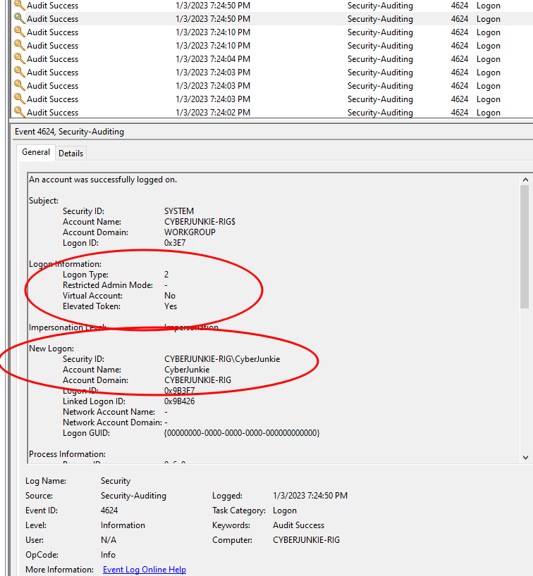
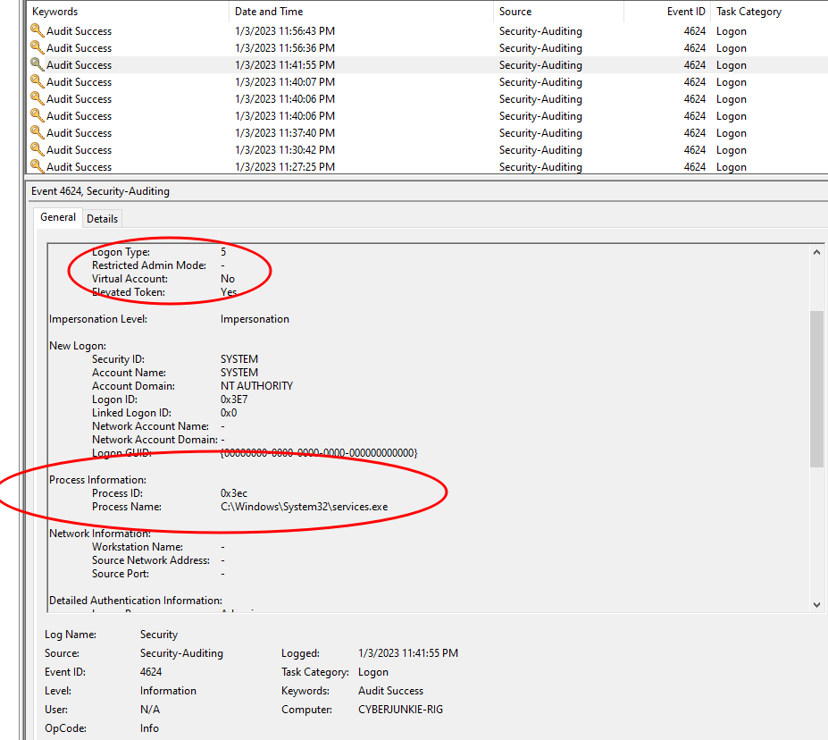
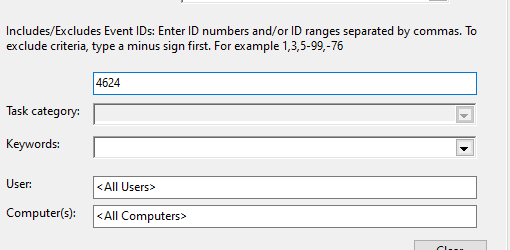
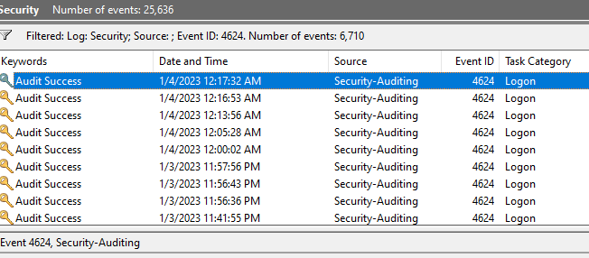
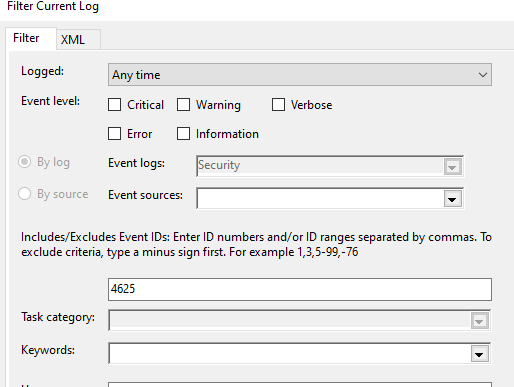
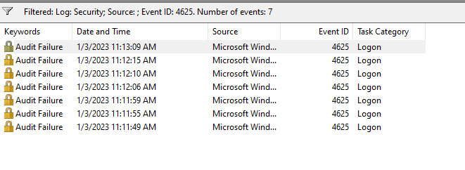
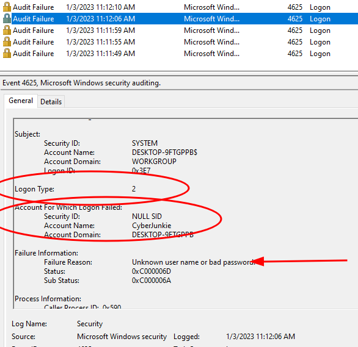

## Journaux d’événements d’authentification

- Windows journalise les authentifications **réussies et échouées** dans le journal `Security`.
- Ces événements permettent notamment de détecter :
    - brute force ;
    - password spraying ;
    - compromission de compte ;
    - utilisation suspecte de credentials ;
    - connexions RDP ;
    - lateral movement.

```text
Authentication Attempt
        ↓
Windows Security Log
        ↓
Success / Failure
        ↓
Context + Correlation
        ↓
Legitimate / Suspicious
```


> Une succession d’échecs suivie d’un succès est un **signal intéressant**, mais pas une preuve suffisante de compromission sans contexte supplémentaire.

---

## Logon Types

- Le **Logon Type** indique **comment la session a été créée**.
- Il est essentiel pour interpréter correctement les événements `4624` et `4625`.

| Logon Type | Nom | Utilisation |
|---:|---|---|
| **2** | Interactive | connexion locale / physique |
| **3** | Network | accès réseau : SMB, partage, accès distant à une ressource |
| **4** | Batch | tâches planifiées / batch |
| **5** | Service | démarrage d’un service sous un compte |
| **7** | Unlock | déverrouillage d’une session |
| **8** | NetworkCleartext | authentification réseau avec credentials transmis à un package d’authentification sous une forme exploitable |
| **9** | NewCredentials | nouvelles credentials pour accès réseau, ex. `runas /netonly` |
| **10** | RemoteInteractive | RDP / Terminal Services |
| **11** | CachedInteractive | logon avec credentials de domaine mis en cache |

> Le cours parle de **9 types de logon**, mais Windows définit davantage de valeurs selon les versions et scénarios. Pour l’analyse SOC, les plus importants sont surtout `2`, `3`, `5`, `9`, `10` et `11`.

---

### Logon Type 2 — Interactive

```text
User
→ Physical / Local Login
→ Logon Type 2
```


- Connexion interactive directement sur la machine.
- Typiquement :
    - console locale ;
    - utilisateur devant le poste.



---

### Logon Type 3 — Network

```text
Remote System
→ Network Resource
→ Logon Type 3
```


Utilisé notamment pour :

- SMB ;
- accès à un partage ;
- certaines opérations d’administration distante ;
- communications authentifiées sur le réseau.

En investigation :

```text
4625
+
Logon Type 3
+
Many Hosts
→ Possible Lateral Movement / Password Guessing
```


---

### Logon Type 4 — Batch

- Utilisé pour les traitements non interactifs.

Exemple :

```text
Scheduled Task
→ User Account
→ Logon Type 4
```


---

### Logon Type 5 — Service

- Créé lorsqu’un service démarre sous un compte.

```text
Service
→ Service Account
→ Logon Type 5
```


- Très fréquent.
- Peut générer beaucoup de bruit dans les journaux.

> Le cours recommande de ne pas se focaliser sur le Type `5` lors d’une première recherche d’authentifications utilisateur, car les services en génèrent énormément. Il ne faut toutefois pas l’ignorer systématiquement : un **nouveau service malveillant** peut justement produire ce type d’événement.



---

### Logon Type 10 — RemoteInteractive

- Typique des connexions :

```text
RDP
Terminal Services
Remote Desktop
```


```text
Remote User
→ RDP
→ Target Host
→ Logon Type 10
```


Très utile pour détecter :

- accès RDP externe ;
- lateral movement ;
- utilisation de comptes privilégiés à distance.

---

## Event ID 4624 — Successful Logon

- Un logon Windows réussi génère généralement :

```text
Event ID 4624
→ Successful Logon
→ Audit Success
```


Pour l’analyse, regarder notamment :

- `Account Name` ;
- `Account Domain` ;
- `Logon Type` ;
- source IP ;
- workstation ;
- authentication package ;
- timestamp.

```text
4624
+
User
+
Logon Type
+
Source IP
+
Target Host
→ Authentication Context
```






---

## Event ID 4625 — Failed Logon

- Une tentative d’authentification échouée génère :

```text
Event ID 4625
→ Failed Logon
→ Audit Failure
```


Informations utiles :

- compte ciblé ;
- domaine ;
- Logon Type ;
- source IP ;
- Failure Reason ;
- Status / SubStatus.







---

### Analyse des échecs

Quelques échecs isolés peuvent correspondre à :

- typo ;
- ancien password ;
- service mal configuré ;
- credential expiré.

Mais :

```text
Many 4625
+
Short Time Window
+
Same Account
+
Same Source
→ Possible Brute Force
```


ou :

```text
Many 4625
+
Many Accounts
+
Same Source
→ Possible Password Spraying
```


#### Brute Force vs Password Spraying

```text
Brute Force
→ Many passwords
→ One / few accounts
```


```text
Password Spraying
→ One / few passwords
→ Many accounts
```


---

### Échec puis succès

Pattern particulièrement intéressant :

```text
4625
4625
4625
4625
4624
```


Peut indiquer :

- utilisateur ayant finalement saisi le bon password ;
- brute force réussi ;
- password spraying réussi ;
- credential compromise.

→ toujours corréler avec :

- source IP ;
- Logon Type ;
- heure ;
- user ;
- hostname ;
- comportement après authentification.

---
