## Détection du lateral movement

Le Logon Type `3` peut être particulièrement utile lorsqu’un attaquant tente d’accéder à plusieurs systèmes.

Exemple :

```text
HOST-A
→ 4625 Type 3 → HOST-B
→ 4625 Type 3 → HOST-C
→ 4624 Type 3 → HOST-D
```


→ peut indiquer :

```text
Credential Guessing
→ Successful Authentication
→ Lateral Movement
```


Une série de `4625` Type `3` sur plusieurs machines mérite une investigation approfondie.

---

## Authentification RDP

- **RDP — Remote Desktop Protocol** est largement utilisé pour :
    - administration ;
    - support ;
    - accès distant.
- Il est également fréquemment utilisé par les attaquants pour le **lateral movement**.

```text
Compromised HOST-A
→ RDP
→ HOST-B
→ RDP
→ HOST-C
```


L’analyse RDP nécessite de considérer :

```text
Source Host
+
Destination Host
```


Où chercher, selon le côté de la connexion :

| Côté | Journal | Event IDs |
|---|---|---|
| Machine **cible** | Security | **4624** Type 10 (logon RDP réussi) · **4625** Type 10 (logon RDP échoué) |
| Machine **cible** | TerminalServices-RemoteConnectionManager/Operational | **261** (connexion TCP RDP reçue) · **1149** (authentification RDP réussie) |
| Machine **source** | TerminalServices-RDPClient/Operational | **1102** (destination contactée) |
| Machine **source** | Security | **4648** (explicit credentials) |

---

## Logs côté machine cible RDP : 4624 Type 10 et 1149

### Event ID 4624 + Logon Type 10

```text
Security Log
→ Event ID 4624
→ Logon Type 10
```


- Une authentification RDP réussie peut être identifiée via cet événement.

```text
4624 + Type 10
→ Remote Interactive Logon
```


---

### TerminalServices-RemoteConnectionManager

Windows dispose également de journaux RDP spécialisés :

```text
Applications and Services Logs
→ Microsoft
→ Windows
→ TerminalServices-RemoteConnectionManager
→ Operational
```


Ils contiennent moins de bruit que le journal `Security`.

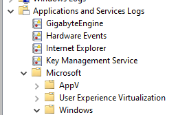

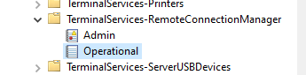

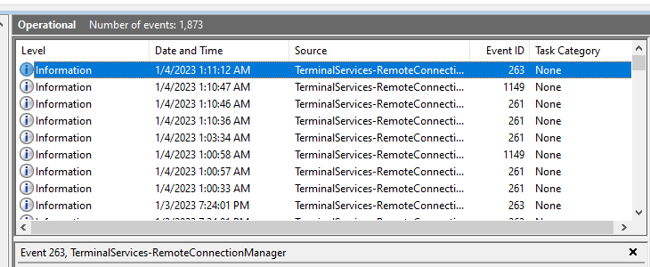

---

### Event ID 1149

```text
Provider:
TerminalServices-RemoteConnectionManager

Event ID:
1149
```


- Signale qu’une **authentification RDP a réussi** au niveau du Remote Connection Manager.
- Peut notamment contenir :
    - username ;
    - domain ;
    - source IP.

```text
1149
→ User Authentication Succeeded
→ Source IP
→ Target Host
```


> `1149` est très utile, mais il vaut mieux le corréler avec `4624 Type 10` et les journaux `LocalSessionManager` pour confirmer la création réelle d’une session interactive RDP.

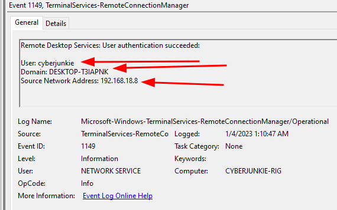

---

### Détecter un système source compromis

Exemple :

```text
HOST-B
receives RDP connection
from
192.168.18.8
```


Si `192.168.18.8 = HOST-A` et que cette activité se produit pendant la fenêtre de compromission :

```text
HOST-A
→ likely compromised
→ investigate HOST-A
```


Le journal de la machine cible peut donc révéler **d’où vient le lateral movement**.

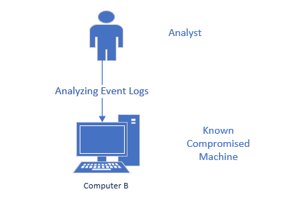

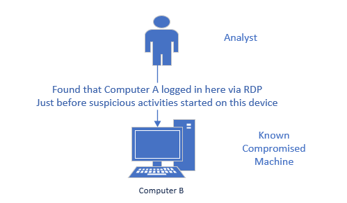

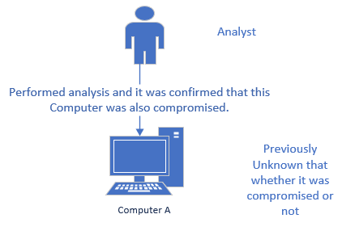

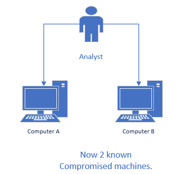

---

## Logs côté machine source RDP : 1102 et 4648

Il est également possible d’identifier les machines **vers lesquelles un endpoint s’est connecté en RDP**.

Journal :

```text
Applications and Services Logs
→ Microsoft
→ Windows
→ TerminalServices-RDPClient
→ Operational
```


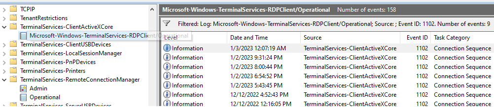

---

### Event ID 1102 — RDP Client

```text
Microsoft-Windows-TerminalServices-RDPClient/Operational (sous TerminalServices-ClientActiveXCore)
→ Event ID 1102
```


- Dans ce provider, peut contenir l’adresse de destination RDP.

```text
Compromised HOST-B
→ Event 1102
→ Destination = HOST-C
```


→ HOST-C devient une nouvelle piste d’investigation.

> ⚠️ Très important : **Event ID 1102 n’a pas toujours la même signification selon le Provider**.

Par exemple :

```text
Security / 1102
→ Audit Log Cleared

TerminalServices-RDPClient / 1102
→ RDP client connection information
```


Donc :

```text
Event ID
+
Provider
+
Log
→ Correct Meaning
```


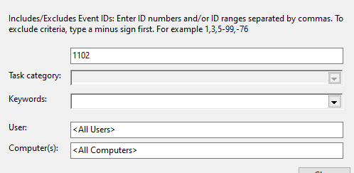

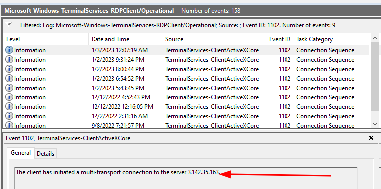

---

### Event ID 4648 — Explicit Credentials

```text
Security
→ Event ID 4648
→ A logon was attempted using explicit credentials
```


- À corréler avec les événements RDP client (`RDPClient 1102`).

Il peut fournir :

- compte utilisé ;
- domaine ;
- target server ;
- process associé.

Exemple :

```text
RDPClient 1102
→ Destination IP

+

Security 4648
→ Target Account / Domain

→ Better RDP Context
```


> `4648` ne prouve pas à lui seul qu’une connexion RDP a réussi : il indique qu’un processus a tenté d’utiliser des **credentials explicitement fournis**.

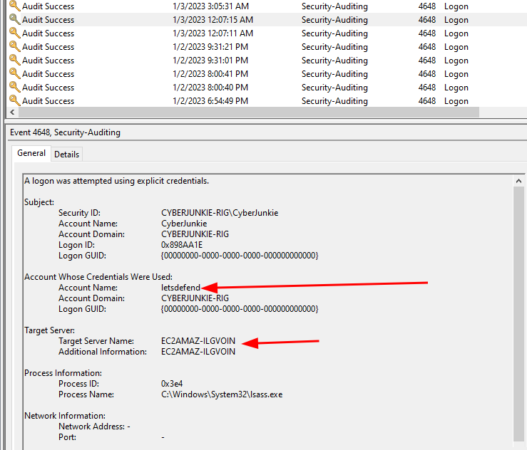

---

## Investigation du lateral movement via RDP

Exemple :

```text
HOST-A
      ↓ RDP
HOST-B
      ↓ RDP
HOST-C
```


Investigation :

```text
HOST-B
→ 1149 / 4624 Type 10
→ Source = HOST-A

HOST-B
→ RDPClient 1102
→ Destination = HOST-C

HOST-C
→ 1149 / 4624 Type 10
→ Source = HOST-B
```


Cela permet de reconstruire progressivement :

```text
Attack Path
→ HOST-A
→ HOST-B
→ HOST-C
```


et donc de déterminer le **scope** réel de l’incident.

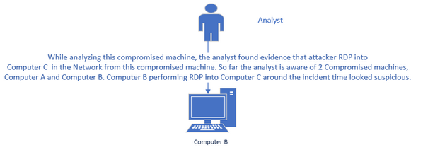

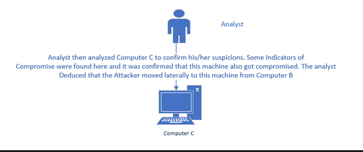

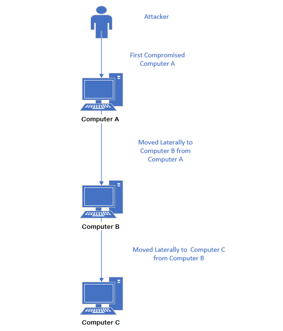

---

## Tentatives RDP échouées : 261 et 4625

### Event ID 261

```text
TerminalServices-RemoteConnectionManager
→ Event ID 261
→ Incoming RDP TCP Connection
```


- Signale une connexion TCP RDP entrante dans `TerminalServices-RemoteConnectionManager`.

```text
Remote Host
→ TCP Connection
→ RDP Service
→ Event 261
```


Mais :

> `261 ≠ authentification RDP échouée`

Il indique qu’une connexion TCP RDP a été reçue.

Cela peut également être :

```text
Port Scan
→ TCP 3389
→ Event 261
```


sans aucune tentative d’authentification.

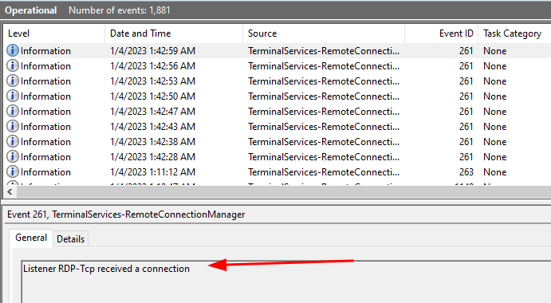

---

### Corrélation 261 + 1149

Pattern possible :

```text
261
→ TCP connection received

1149 shortly after
→ authentication succeeded
```


Si :

```text
261
→ no 1149
```


on **peut suspecter** un échec, mais pas le confirmer.

Cette méthode n’est pas fiable à 100 %.

---

### Méthode plus fiable : Event ID 4625

```text
Security
→ 4625
→ Logon Type 10
```


- Une authentification RDP échouée peut apparaître dans cet événement.

On peut alors récupérer :

- username ;
- source IP ;
- Logon Type ;
- Failure Reason.

```text
261
+
4625 Type 10
→ Failed RDP Authentication
```


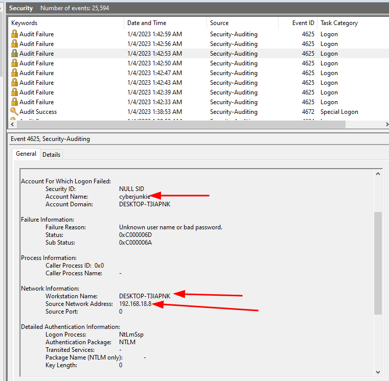

---

## Corrélation RDP recommandée

```text
RemoteConnectionManager / 261
→ connexion TCP RDP reçue

RemoteConnectionManager / 1149
→ authentification RDP réussie

Security / 4624 Type 10
→ logon RemoteInteractive réussi

Security / 4625 Type 10
→ logon RDP échoué

Security / 4648
→ explicit credentials utilisées

RDPClient / 1102
→ destination contactée côté client
```


> Aucun de ces événements ne doit être analysé isolément : la corrélation donne une vision beaucoup plus fiable.

---
