Source des captures : [Hack The Box Academy - Event Log Analysis](https://academy.hackthebox.com/course/preview/event-log-analysis)

## Journaux d’événements des tâches planifiées Windows

Le **Task Scheduler** exécute automatiquement des programmes, des scripts, des sauvegardes ou des tâches de maintenance, en réponse à un déclencheur : une heure, un calendrier ou un événement. Une tâche peut être créée localement ou à distance, depuis l’interface graphique, en ligne de commande (CLI / PowerShell) ou par l’API Windows.

Une tâche relie toujours un déclencheur à une action : `Trigger → Scheduled Task → Action → Program / Script / Command`.

## Abus offensif des Scheduled Tasks

Un attaquant crée ou modifie une tâche pour exécuter du code, maintenir une **persistence** en relançant régulièrement un malware, agir avec des privilèges élevés, ou cacher son activité derrière un nom de tâche d’apparence légitime. MITRE ATT&CK range cette technique sous **T1053.005 — Scheduled Task/Job: Scheduled Task**.

Schéma typique : `Malicious Script → Scheduled Task → Trigger every day → Persistence`.

> Une tâche ne s’exécute pas automatiquement avec les « privilèges du Task Scheduler » : elle s’exécute dans le **security context configuré pour la tâche**. Si elle est configurée sous `SYSTEM` ou avec `Run with highest privileges`, l’impact peut être particulièrement important.

## Intérêt forensique

Les Event Logs conservent la trace d’une tâche même après sa suppression : son nom, son auteur, son déclencheur, sa commande et ses arguments, puis ses modifications et sa suppression. Un attaquant qui crée une tâche, l’exécute puis la supprime fait disparaître la tâche, pas la preuve : **Task no longer exists ≠ Evidence no longer exists**.

## Deux journaux à consulter

| Journal | Où le trouver | Ce qu’il apporte |
|---|---|---|
| **Security** | Windows Logs → Security | Les événements détaillés (4698 à 4702), avec l’auteur et la définition de la tâche. Ils nécessitent l’audit approprié : dans **Advanced Audit Policy**, Object Access → **Audit Other Object Access Events**. |
| **TaskScheduler/Operational** | Applications and Services Logs → Microsoft → Windows → TaskScheduler → Operational | Moins d’informations que Security, mais disponible même quand les événements détaillés de Security ne le sont pas : très utile pour reconstruire l’activité. |

> Si cette journalisation n’est pas activée, les Event IDs `4698/4699/4702` peuvent être absents.

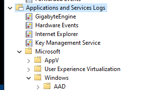

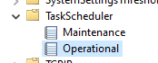

Les deux journaux suivent la vie d’une tâche, de sa création à sa suppression :

| Étape | Security | TaskScheduler/Operational |
|---|---|---|
| Création | **4698** — A scheduled task was created | **106** — Task registered |
| Exécution | — | **200** — Action started · **201** — Action completed |
| Modification | **4702** — A scheduled task was updated | **140** — Task updated |
| Activation / désactivation | **4700** — Task enabled · **4701** — Task disabled | — |
| Suppression | **4699** — A scheduled task was deleted | **141** — Task deleted |

## Création : 4698 et 106

**4698** (Security) est l’événement le plus riche. Il indique l’utilisateur qui a créé la tâche, son nom, son déclencheur, le compte sous lequel elle tourne (account / security context), le programme exécuté et ses arguments, et, selon la version de Windows, la définition XML complète de la tâche.

Exemple :

```text
Task Name:
\Windows Update Task

Author:
CyberJunkie

Trigger:
Friday 15:00

Command:
powershell.exe

Arguments:
-File C:\Users\user\Documents\malicious.ps1
```


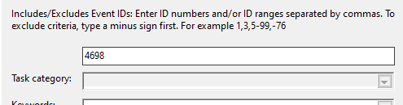

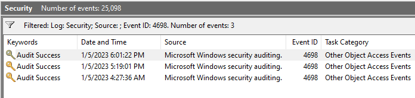

Les champs à examiner répondent à six questions :

| Question | Champs |
|---|---|
| Qui l’a créée ? | `SubjectUserName`, `Author` |
| Quelle tâche ? | `TaskName` |
| Quand s’exécute-t-elle ? | `Triggers` |
| Sous quel compte, avec quels privilèges ? | `UserId`, `RunLevel` |
| Qu’exécute-t-elle, et depuis où ? | `Command`, `Arguments` |

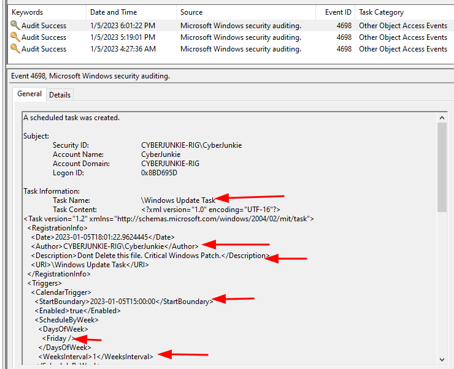

Côté TaskScheduler/Operational, **106** signale qu’une tâche vient d’être enregistrée (elle apparaît sur le système) et donne notamment son **Task Name**.

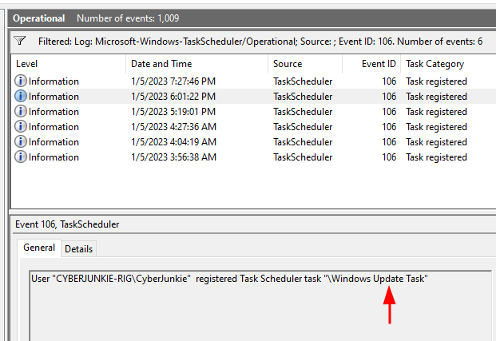

## Exécution : 200 et 201

**200** marque le début de l’action, **201** sa fin. Le cours s’appuie sur 201, qui permet de retrouver des informations sur l’action exécutée. Avec 106, ils distinguent une tâche qui existe d’une tâche qui s’est réellement exécutée : **Task exists ≠ Task actually executed**.

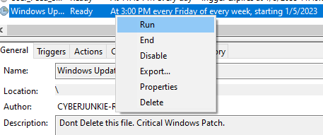

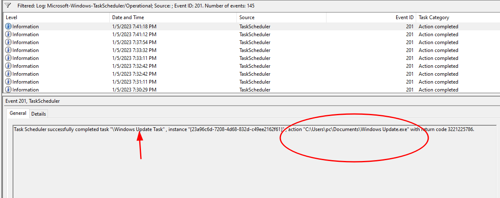

## Modification : 4702 et 140

**4702** (Security) se déclenche quand une tâche existante est modifiée. Il contient des informations comparables à la création : nom de la tâche, nouvelle définition, déclencheur, programme et arguments. **140** signale la même modification dans TaskScheduler/Operational, généralement avec moins de détails.

Modifier une tâche légitime est plus discret que d’en créer une nouvelle : l’attaquant remplace l’action d’une tâche existante par son propre code. Dans l’exemple du cours, le déclencheur passe de « vendredi à 15 h » à « tous les jours à midi » ; comparer `4698 ↔ 4702` montre exactement ce qui a changé.

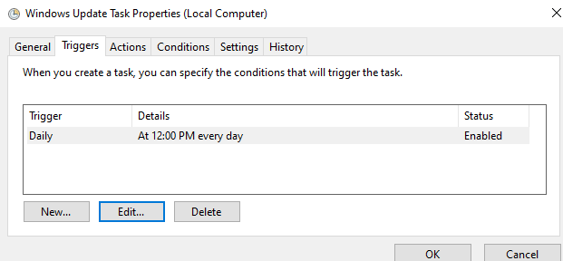

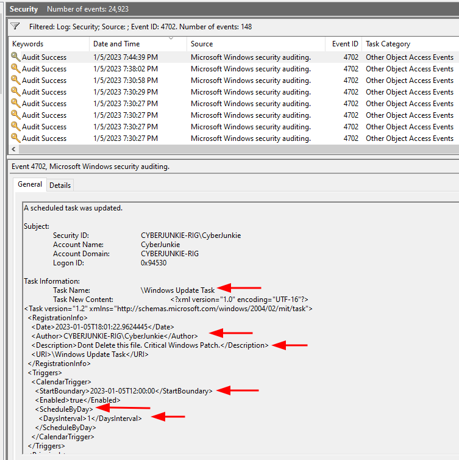

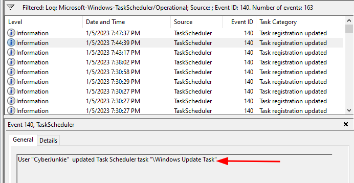

Un attaquant peut aussi **réactiver une tâche existante** plutôt que d’en créer une : **4700** (tâche activée) et **4701** (tâche désactivée) complètent alors l’enquête.

## Suppression : 4699 et 141

**4699** (Security) donne le nom de la tâche supprimée, l’utilisateur qui a effectué l’action et l’horodatage ; **141** (TaskScheduler/Operational) indique la même suppression, avec surtout le nom de la tâche et l’horodatage.

Une suppression peut être légitime. Mais une tâche créée, exécutée de façon malveillante puis supprimée peu après peut indiquer une tentative de **cleanup / Defense Evasion**.

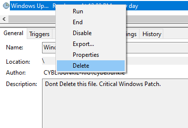

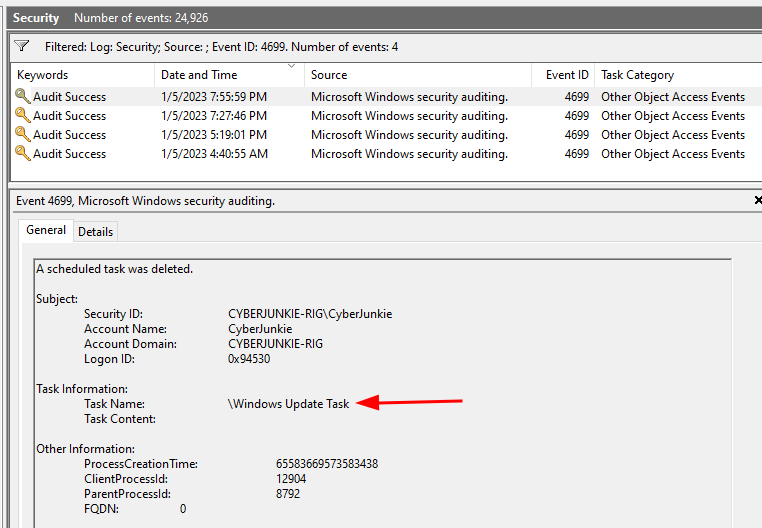

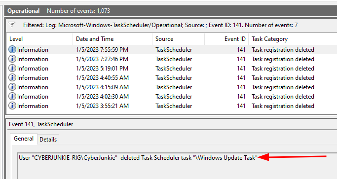

## Reconnaître une tâche suspecte

| Indice | Ce qui doit alerter | Exemple |
|---|---|---|
| **Nom** | Un nom qui imite une tâche légitime : Windows Update, Microsoft Update Service, System Maintenance, AdobeUpdate, ChromeUpdate | « Windows Update Task » créée par CyberJunkie |
| **Chemin** | Un exécutable au nom système dans un dossier modifiable par l’utilisateur : `%TEMP%`, `%APPDATA%`, `%LOCALAPPDATA%`, Downloads, Documents, `C:\Users\Public` | `C:\Users\user\Documents\Windows Update.exe` pour un composant censé être Windows Update |
| **Programme** | Un interpréteur ou un LOLBin : `powershell.exe`, `cmd.exe`, `wscript.exe`, `cscript.exe`, `mshta.exe`, `rundll32.exe`, `regsvr32.exe` | Tâche qui lance PowerShell |
| **Arguments** | `-EncodedCommand`, `-ExecutionPolicy Bypass`, `-hidden`, `DownloadString`, `IEX`, une URL ou une IP | PowerShell avec une commande encodée |
| **Compte** | Une tâche nouvelle qui tourne sous `SYSTEM` | — |
| **Calendrier** | Un déclencheur inhabituel, une création ou une modification pendant la fenêtre d’incident, une suppression rapide après exécution | Créée à 10:14, supprimée à 15:47 |

> Le nom d’une tâche n’est jamais une preuve de légitimité.

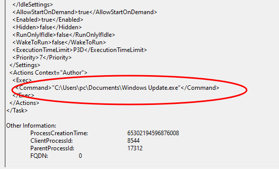

Les tâches légitimes de Windows sont souvent créées et exécutées sous `NT AUTHORITY\SYSTEM`, mais **SYSTEM ≠ automatically legitimate** : un attaquant qui a déjà obtenu des privilèges administrateur peut lui aussi créer une tâche exécutée sous `SYSTEM`. Aucun indice ne suffit seul ; il faut croiser le créateur de la tâche, la commande, le chemin, l’horodatage, le déclencheur et le contexte de l’incident. C’est leur cumul (tâche nouvelle ou modifiée, chemin modifiable, LOLBin ou script, commande encodée, privilèges `SYSTEM`, déclencheur inhabituel, fenêtre d’incident) qui rend une tâche très suspecte. Une tâche qui lance PowerShell avec une commande encodée, suivie d’une connexion réseau externe, devient une priorité d’investigation.

## Corrélation et chronologie

L’analyse d’une Scheduled Task ne doit pas s’arrêter à l’événement `4698`. En croisant les journaux de la tâche avec la création de processus (`4688`) et les traces réseau ou EDR, on reconstruit toute la chaîne :

| Heure | Source | Ce qui s’est passé |
|---|---|---|
| 10:14 | Security **4698** | Tâche « \Windows Update » créée |
| 10:15 | TaskScheduler **200** | Action démarrée |
| 10:15 | Security **4688** | `powershell.exe` exécuté |
| 10:15 | EDR / réseau | Connexion vers le C2 de l’attaquant |
| 12:03 | Security **4702** | Tâche modifiée |
| 15:47 | **4699** / **141** | Tâche supprimée |

Lue dans l’ordre, cette chronologie retrace **Persistence → Execution → C2 → Cleanup**, même si la tâche a disparu du système.

Le point important est de ne pas seulement chercher **si une tâche existe actuellement** : les Event Logs permettent de reconstruire **sa création, ses modifications, son exécution et sa suppression**, ce qui en fait une source particulièrement utile pour détecter les mécanismes de **Persistence / Execution** basés sur `T1053.005`.
