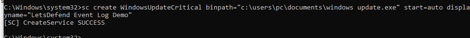
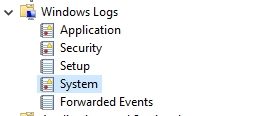
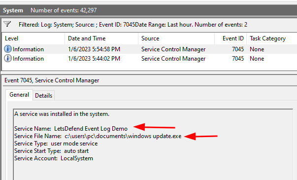
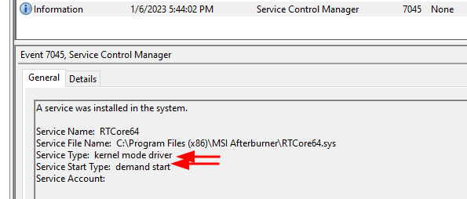

## Journaux d’événements des services Windows

- Les **Windows Services** sont des processus d’arrière-plan pouvant fonctionner sans session utilisateur ouverte.
- Ils peuvent notamment :
    - démarrer automatiquement avec Windows ;
    - écouter des connexions réseau ;
    - effectuer des tâches de maintenance ;
    - fournir des fonctionnalités à d’autres applications.

Exemples :

```text
Print Spooler
Task Scheduler
Windows Update
```


### Types de services

Le cours distingue principalement :

- **System Services** : composants installés/utilisés par Windows, certains drivers ou fonctions système.
- **Application Services** : installés avec des applications pour fournir leurs fonctionnalités.

Techniquement, Windows définit plusieurs `ServiceType` (`Win32OwnProcess`, `Win32ShareProcess`, `KernelDriver`, etc.). Le champ **Service Type** ne permet pas de déterminer qui a installé le service.

---

## Abus des services Windows

Les attaquants peuvent détourner les services pour :

- créer une **persistence** ;
- exécuter du code malveillant ;
- lancer un reverse shell ;
- maintenir un canal C2 secondaire ;
- exécuter du code avec des privilèges élevés ;
- modifier un service légitime ;
- arrêter ou désactiver un service de sécurité.

```text
Service
→ Automatic Start
→ Malicious Binary
→ Persistence / Execution
```


MITRE ATT&CK :

```text
T1543.003
→ Create or Modify System Process: Windows Service
```


### Techniques possibles

#### Création d’un nouveau service

```text
Attacker
→ Create Service
→ Malicious Binary
→ Auto Start
```




#### Modification d’un service existant

```text
Legitimate Service
→ Modify ImagePath / Configuration
→ Malicious Binary
```


#### Désactivation d’un service

Exemples :

- AV / EDR ;
- backup agent ;
- logging service ;
- application critique.

```text
Security Service
→ Stop / Disable
→ Defense Evasion
```


### Pourquoi les services sont intéressants pour un attaquant

Windows contient un grand nombre de services. Un attaquant peut donc essayer de se fondre dans cet environnement avec un nom ressemblant à un composant légitime :

```text
WindowsUpdateCritical
Windows Update Service
MicrosoftUpdate
SystemMaintenance
```


> Un nom crédible ne constitue jamais une preuve de légitimité.

Une configuration en démarrage automatique permet également :

```text
System Boot
→ Malicious Service Starts
→ Persistence Restored
```


---

## Où chercher : System ou Security

- **System** (`Windows Logs → System`, provider **Service Control Manager**) : 7045, 7040, 7036.
    - Généralement la source la plus couramment utilisée pour détecter l’installation d’un service.
- **Security** : 4697.
    - Seulement si l’audit correspondant est activé (Audit Policies).

Vue d’ensemble, étape par étape :

| Étape | System (Service Control Manager) | Security (si l’audit est activé) |
|---|---|---|
| Installation | **7045** — A service was installed in the system | **4697** — A service was installed in the system |
| Modification du démarrage | **7040** — Start type changed | — |
| Démarrage / arrêt | **7036** — Service entered the running / stopped state | — |

---

## Installation : 7045 et 4697

### Event ID 7045 — Service Installed

```text
Windows Logs
→ System
→ Provider : Service Control Manager
→ 7045
→ A service was installed in the system
```


- La création d’un nouveau service est notamment enregistrée dans ce journal.





#### Informations intéressantes

L’événement `7045` permet généralement d’obtenir :

- `Service Name` ;
- `Service File Name` / binary path ;
- `Service Type` ;
- `Start Type` ;
- compte utilisé par le service ;
- timestamp.

```text
7045
→ New Service
→ Binary Path
→ Start Type
→ Account
→ Investigate
```


#### Start Type

Le type de démarrage indique quand le service doit être lancé. Valeurs communes :

```text
Automatic
Manual
Disabled
```


Un service malveillant configuré en `Start Type = Automatic` peut fournir une persistence après reboot.

#### Analyse du Binary Path

Le chemin de l’exécutable est l’un des éléments les plus importants. Exemple du cours :

```text
Service:
WindowsUpdateCritical

Binary:
C:\Users\<user>\Documents\Windows Update.exe
```


Un composant prétendant être Windows Update dans `C:\Users\<user>\Documents\` est fortement suspect.

##### Répertoires intéressants

Pour un service, surveiller notamment les exécutables placés dans :

```text
%TEMP%
%APPDATA%
%LOCALAPPDATA%
Downloads
Documents
C:\Users\Public
```


Ces emplacements sont généralement **user-writable**, ce qui les rend intéressants pour les attaquants.

```text
System-looking Service
+
User-writable Binary Path
→ Strong Suspicion
```


#### Service Type

Le champ `Service Type` indique la nature technique du service. Exemples :

```text
Win32 Service
Kernel Driver
File System Driver
```


> ⚠️ Le cours laisse entendre qu’il permet de savoir si le service a été « installé par l’utilisateur ou par le système ». Ce n’est pas son rôle. Il indique principalement le type d’exécution du service/driver, pas son créateur.

Un attaquant peut très bien créer un service Windows classique (`ServiceType = Win32OwnProcess`) avec des privilèges administrateur.



#### Contexte d’exécution

Un service peut s’exécuter sous différents comptes :

```text
LocalSystem
LocalService
NetworkService
Domain Account
Custom Service Account
```


Un service suspect exécuté sous `LocalSystem` est particulièrement intéressant car `SYSTEM` possède des privilèges très élevés sur la machine.

```text
Malicious Service
+
LocalSystem
→ High Impact
```


---

### Event ID 4697 — Service Installed

```text
Security Log
→ Event ID 4697
→ A service was installed in the system
```


- Si l’audit correspondant est activé, une installation de service peut également être enregistrée dans ce journal.

Il peut compléter `7045` :

```text
System / 7045
+
Security / 4697
→ Better Context
```


`4697` dépend de la configuration des Audit Policies, alors que `7045` est généralement la source la plus couramment utilisée pour détecter l’installation d’un service.

---

## Modification : 7040

### Event ID 7040 — Start Type Changed

```text
System
→ Service Control Manager
→ 7040
→ Start type changed
```


- Un attaquant peut également modifier le mode de démarrage d’un service existant.

Exemple : `Manual → Automatic`, ou `Automatic → Disabled`.

Peut indiquer :

- persistence ;
- désactivation d’un contrôle de sécurité ;
- modification administrative légitime.

```text
7040
+
Service Name
+
Timestamp
+
User / Process Context
→ Investigate
```


---

## Démarrage et arrêt : 7036

### Event ID 7036 — Service State Changed

```text
System
→ Service Control Manager
→ 7036
→ Service state changed
```


Permet d’observer certains changements d’état :

```text
Service entered the running state
Service entered the stopped state
```


Cela peut être utile pour reconstruire :

```text
Service Installed
→ Service Started
→ Network Connection
```


ou :

```text
EDR Service
→ Stopped
→ Suspicious Activity
```


---

## Corrélation recommandée (services)

L’événement `7045` ne doit pas être analysé seul. Exemple :

```text
7045
→ suspicious service installed
        ↓
4688
→ malicious executable started
        ↓
7036
→ service running
        ↓
EDR / Firewall
→ outbound connection
        ↓
C2
```


On peut ainsi reconstruire :

```text
Persistence
→ Execution
→ Command & Control
```


### Exemple de détection

```text
7045
Service Name:
WindowsUpdateCritical

Binary:
C:\Users\Alice\Documents\Windows Update.exe

Start Type:
Automatic

Account:
LocalSystem
```


Plusieurs éléments deviennent suspects :

```text
Fake-looking Windows name
+
Binary in user directory
+
Automatic Start
+
SYSTEM privileges
→ High-Priority Investigation
```


---

## Analyse du binaire

Si le fichier existe encore :

1. préserver une copie ;
2. calculer ses hashes ;
3. analyser ses métadonnées ;
4. vérifier signature et réputation ;
5. effectuer si nécessaire une analyse statique/dynamique.

```text
Suspicious Binary
→ Preserve
→ Hash
→ Static Analysis
→ Dynamic Analysis
```


### VirusTotal

Un hash peut être recherché sur VirusTotal :

```text
SHA-256
→ VirusTotal
→ Reputation / Existing Analysis
```


Si le fichier est inconnu, il peut ensuite nécessiter :

- static analysis ;
- sandboxing ;
- reverse engineering ;
- behavioral analysis.

> Ne pas considérer `0 detections` comme « fichier sain ». Un malware récent, obfusqué ou ciblé peut être inconnu des moteurs.

Dans un environnement réel, éviter également d’envoyer aveuglément un fichier potentiellement sensible ou interne à un service public : commencer par une recherche par hash et respecter les procédures de l’organisation.

---

## Patterns SOC intéressants (services)

### Nouveau service suspect

```text
7045
+
Unknown Service
+
User-writable Path
→ Suspicious
```


### Persistence

```text
7045
+
Start Type = Automatic
+
Suspicious Binary
→ Possible Persistence
```


### Privileged execution

```text
7045
+
Account = LocalSystem
+
Unknown Binary
→ High Risk
```


### Defense Evasion

```text
7040
+
EDR / AV Service
→ Disabled
```


### C2

```text
Service Starts
+
Process Created
+
Outbound Connection
→ Possible Service-based C2
```


---

## Vue d’ensemble (services)

```text
Windows Services
│
├─ 7045
│  → Service installed
│
├─ 7040
│  → Start type changed
│
├─ 7036
│  → Service running / stopped
│
└─ Security 4697
   → Service installed
   → if auditing enabled
```


Pour une investigation :

```text
Service Event
→ Name
→ Binary Path
→ Start Type
→ Account / Privileges
→ Timestamp
→ Binary Analysis
→ Process / Network Correlation
```


Le point central est que la création ou modification d’un service n’est pas malveillante en soi. Ce sont surtout le chemin du binaire, le contexte d’exécution, les privilèges, le type de démarrage et les événements corrélés qui permettent de distinguer un service légitime d’un mécanisme de `Persistence / Execution` malveillant.

Source : prise de notes à partir du module [Hack The Box Academy - Event Log Analysis](https://academy.hackthebox.com/app/module/387), section « Journaux d’événements des services Windows ».
