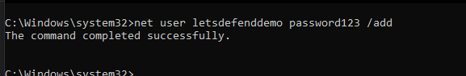
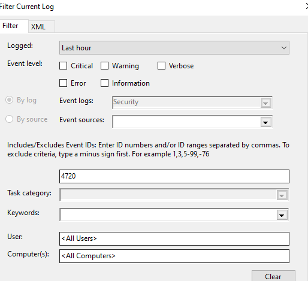
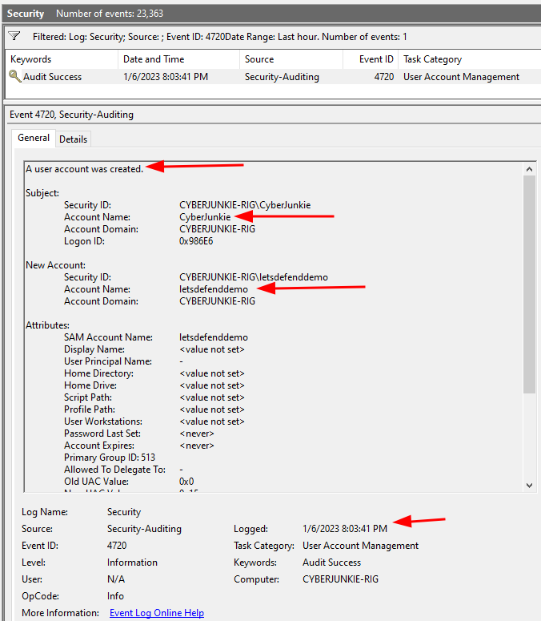
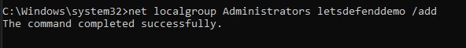
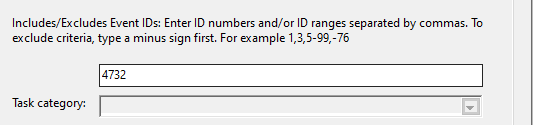
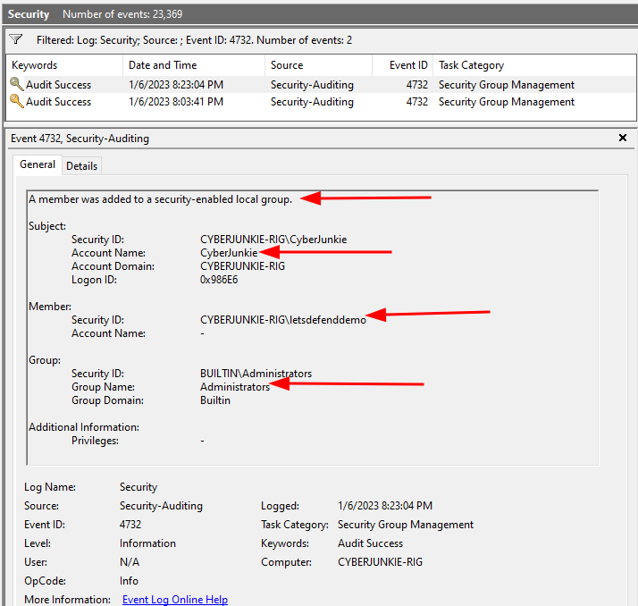

Source des captures : [Hack The Box Academy - Event Log Analysis](https://academy.hackthebox.com/course/preview/event-log-analysis)

## Événements de gestion des comptes — Account Management Events

- Les attaquants peuvent manipuler les comptes Windows pour :
    - établir une **persistence** ;
    - obtenir des **privilèges supplémentaires** ;
    - disposer d’une **identité alternative** ;
    - masquer certaines activités derrière un compte apparemment légitime.

```text
Initial Compromise
→ Create Account
→ Add to Privileged Group
→ Persistent / Privileged Access
```


Ces actions sont souvent moins bruyantes que certaines persistences basées sur :

- services ;
- Scheduled Tasks ;
- beaconing C2 permanent.

## Où chercher : audit des changements de comptes

Les événements de gestion des comptes sont enregistrés dans :

```text
Windows Logs
→ Security
```


Ils dépendent de la configuration des **Audit Policies**, notamment :

```text
Account Management
→ Audit User Account Management
→ Audit Security Group Management
```


> Il est donc important de vérifier que l’audit des changements de comptes et groupes est activé dans l’environnement.

Vue d’ensemble, étape par étape :

| Étape | Event IDs (Security) |
|---|---|
| Création | **4720** — A user account was created |
| Élévation (ajout à un groupe) | **4732** — groupe local · **4728** — groupe global · **4756** — groupe universel |
| Modification, réactivation | **4722** — account enabled · **4738** — account changed · **4723 / 4724** — mot de passe changé / réinitialisé |
| Utilisation | **4624** / **4625** / **4648** — logon du nouveau compte (voir « Corrélation ») |
| Désactivation, retrait, suppression | **4725** — account disabled · **4729 / 4733 / 4757** — retiré d’un groupe · **4726** — account deleted |

## Création : 4720

### Event ID 4720 — User Account Created



Lorsqu’un nouveau compte utilisateur est créé :

```text
Security
→ Event ID 4720
→ A user account was created
```




Informations importantes :

- **Subject** :
    - compte ayant réalisé l’action ;
- **New Account / Target Account** :
    - compte nouvellement créé ;
- SID ;
- domaine / ordinateur ;
- timestamp ;
- certains attributs du compte.

```text
Subject
→ Who created the account?

Target Account
→ Which account was created?
```


### Exemple

```text
Subject Account:
CyberJunkie

New Account:
letsdefenddemo
```




Interprétation :

```text
CyberJunkie
→ creates
→ letsdefenddemo
```


Si cette action se produit pendant une fenêtre de compromission connue :

```text
Compromised Account
+
4720
+
Unexpected New User
→ Possible Persistence
```


### Noms de comptes trompeurs

Les attaquants peuvent utiliser des noms ressemblant à des comptes légitimes :

```text
Administrator2
SysAdmin
HelpDesk
Support
BackupAdmin
ServiceAccount
```


Objectif :

```text
Malicious Account
→ Looks Legitimate
→ Blend Into Environment
```


Le nom du compte n’est jamais suffisant pour conclure. Il faut vérifier :

- qui l’a créé ;
- quand ;
- depuis quel contexte ;
- quels groupes lui ont ensuite été attribués.

### Établir une baseline des comptes

En environnement administré, il est utile de connaître :

- comptes locaux attendus ;
- comptes de service ;
- comptes administratifs ;
- comptes temporaires ;
- comptes désactivés.

```text
Expected Accounts
        vs
Observed Accounts
→ Unexpected Account?
```


Une création inattendue sur un endpoint sensible doit être investiguée.

## Élévation : ajout à un groupe privilégié (4732, 4728, 4756)

Un nouveau compte possède généralement peu de privilèges.

Un attaquant peut ensuite l’ajouter à un groupe comme :

```text
Administrators
Remote Desktop Users
Backup Operators
```


Exemple :

```text
New User
→ Administrators
→ Local Administrative Privileges
```




### Event ID 4732 — Member Added to Local Security Group

Lorsqu’un membre est ajouté à un groupe local de sécurité :

```text
Security
→ 4732
→ A member was added to a security-enabled local group
```




Informations utiles :

- **Subject** : compte ayant effectué l’ajout.
- **Member** : compte ou SID ajouté.
- **Group** : groupe cible.

```text
Subject
→ adds
→ Member
→ to
→ Group
```


Exemple :

```text
Subject:
CyberJunkie

Member:
letsdefenddemo

Group:
Administrators
```




Chaîne d’activité :

```text
4720
→ letsdefenddemo created

4732
→ letsdefenddemo added to Administrators
```


→ fortement suspect si ces événements apparaissent pendant une compromission.

### Event IDs 4728 / 4756 — Local vs Domain Groups

`4732` concerne les **Local Security Groups**.

Dans Active Directory, d’autres Event IDs existent selon le type de groupe :

```text
4728
→ Member added to Global Security Group

4732
→ Member added to Local Security Group

4756
→ Member added to Universal Security Group
```


Exemple critique :

```text
4728
+
Group = Domain Admins
→ High-Priority Investigation
```


### Subject vs Target / Member

Cette distinction est essentielle en investigation :

```text
Subject
→ Actor
→ account performing the change

Target / Member
→ Object affected
→ account being created / modified / added
```


Ne pas confondre :

```text
Who performed the action?
≠
Who received the privileges?
```


## Modification et réactivation : 4722, 4738, 4723 / 4724

### Event ID 4722 — Account Enabled

```text
Security
→ 4722
→ A user account was enabled
```


- Un attaquant peut réactiver un ancien compte plutôt que d’en créer un nouveau.

### Event ID 4738 — Account Changed

```text
Security
→ 4738
→ A user account was changed
```


Peut indiquer une modification de :

- propriétés du compte ;
- flags ;
- informations associées.

### Event IDs 4723 / 4724 — Password Operations

```text
Security
→ 4723 → Attempt to change account password
→ 4724 → Attempt to reset account password
```


Particulièrement intéressants lorsqu’ils concernent :

- privileged account ;
- service account ;
- compte sensible.

## Désactivation, retrait et suppression : 4725, 4729 / 4733 / 4757, 4726

### Event ID 4725 — Account Disabled

```text
Security
→ 4725
→ A user account was disabled
```


Peut correspondre à :

- action administrative ;
- containment ;
- sabotage.

### Event IDs 4729 / 4733 / 4757 — Member Removed from a Group

Événements complémentaires :

```text
4729
→ Member removed from Global Security Group

4733
→ Member removed from Local Security Group

4757
→ Member removed from Universal Security Group
```


Ils peuvent être utiles pour :

- containment ;
- cleanup ;
- attacker covering tracks.

### Event ID 4726 — Account Deleted

```text
Security
→ 4726
→ A user account was deleted
```


- Un attaquant peut supprimer un compte après utilisation pour réduire ses traces.

```text
Create
→ Use
→ Delete
```


## Corrélation

### Corrélation 4720 + 4732

Pattern très intéressant :

```text
4720
→ New Account Created

shortly after

4732
→ Account Added to Administrators
```


Peut représenter :

```text
Persistence
+
Privilege Escalation / Privileged Access
```


Exemple :

```text
14:02 → 4720
user "backupsvc" created

14:03 → 4732
backupsvc added to Administrators

14:05 → 4624
backupsvc logs on
```


→ séquence hautement suspecte.

### Corrélation avec les événements d’authentification

Après création d’un compte, rechercher :

```text
4624
→ Successful Logon

4625
→ Failed Logon

4648
→ Explicit Credentials
```


Exemple :

```text
4720
→ Account Created

4732
→ Added to Administrators

4624
→ Account Successfully Logged On
```


→ permet de vérifier si l’attaquant a réellement utilisé le compte.

## Attaques possibles

### Persistence

```text
Attacker
→ Creates Local User
→ Adds to Administrators
→ Uses Account Later
```


### Privileged Access

```text
Existing User
→ Added to Administrators
→ Elevated Capabilities
```


### Defense Evasion

Plutôt que de créer un compte avec un nom évident :

```text
hacker123
```


un attaquant peut choisir :

```text
svc_backup
helpdesk
support
```


ou réutiliser un compte existant.

## MITRE ATT&CK

Ces comportements correspondent notamment à :

```text
T1136
→ Create Account
```


Sous-techniques :

```text
T1136.001
→ Local Account

T1136.002
→ Domain Account

T1136.003
→ Cloud Account
```


La modification de groupes / privilèges relève plutôt d’**Account Manipulation** :

```text
T1098
→ Account Manipulation
```


## Attention aux faux positifs

Un événement `4720` ou `4732` n’est pas automatiquement malveillant.

Actions légitimes possibles :

- onboarding ;
- administration ;
- déploiement automatisé ;
- création de service account ;
- support IT.

Il faut contextualiser :

```text
Event
+
Creator
+
Target Account
+
Group
+
Time
+
Host
+
Change Request
→ Legitimate / Suspicious
```


## À propos de la Privilege Escalation

Le cours associe aussi certaines exploitations Windows comme **Print Spooler** ou les techniques **Potato** à cette logique.

Il faut distinguer :

```text
Account Manipulation
→ création / modification de comptes et groupes

Privilege Escalation Exploit
→ élévation de privilèges via vulnérabilité ou token abuse
```


Un exploit peut ensuite permettre à l’attaquant de créer un compte privilégié, mais l’exploitation elle-même n’est pas un événement de gestion de compte.

## Patterns SOC intéressants (comptes)

### Nouveau compte + groupe admin

```text
4720
+
4732
+
Group = Administrators
→ High Suspicion
```


### Réactivation d’un compte dormant

```text
4722
+
4624 shortly after
→ Investigate
```


### Compte privilégié ajouté dans AD

```text
4728
+
Domain Admins
→ Critical Investigation
```


### Création puis suppression rapide

```text
4720
→ Account Created

4624
→ Used

4726
→ Deleted
```


→ possible cleanup / Defense Evasion.

## Vue d’ensemble (comptes)

```text
User Account Management
│
├─ 4720 → Account Created
├─ 4722 → Account Enabled
├─ 4725 → Account Disabled
├─ 4726 → Account Deleted
├─ 4738 → Account Changed
├─ 4723 → Password Change
└─ 4724 → Password Reset

Group Membership
│
├─ 4728 → Added to Global Group
├─ 4729 → Removed from Global Group
├─ 4732 → Added to Local Group
├─ 4733 → Removed from Local Group
├─ 4756 → Added to Universal Group
└─ 4757 → Removed from Universal Group
```


Pour une investigation, une chaîne particulièrement importante est :

```text
4720
→ Account Created

4732 / 4728
→ Privileged Group Membership

4624
→ Account Used
```


Ce n’est donc pas uniquement la création du compte qui est intéressante, mais toute sa **lifecycle activity** : création → modification → élévation → utilisation → suppression.

Source des captures : [Hack The Box Academy - Event Log Analysis](https://academy.hackthebox.com/course/preview/event-log-analysis)
