Source des captures : [Hack The Box Academy - Event Log Analysis](https://academy.hackthebox.com/course/preview/event-log-analysis)

## Manipulation des journaux d’événements

Les attaquants peuvent tenter de manipuler les Event Logs afin de :

- effacer leurs traces ;
- réduire la visibilité du SOC ;
- compliquer l’investigation ;
- masquer des activités déjà réalisées ;
- empêcher la journalisation d’actions futures.

```text
Compromise
→ Malicious Activity
→ Clear / Disable Logging
→ Reduce Defender Visibility
```


MITRE ATT&CK :

```text
T1070.001
→ Indicator Removal: Clear Windows Event Logs
```


## Où chercher

| Étape | Journal | Event ID |
|---|---|---|
| Effacement du journal Security | Security | **1102** — The audit log was cleared |
| Effacement d’un autre journal | System (Microsoft-Windows-Eventlog) | **104** — The <log name> file was cleared |
| Arrêt de la journalisation | Security | **1100** — The event logging service has shut down |

## Effacement des Event Logs

Sous Windows, un journal peut notamment être effacé via :

### Event Viewer

```text
Event Viewer
→ Log
→ Clear Log
```


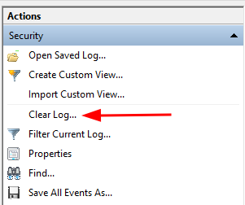

### Ligne de commande `wevtutil`

```cmd
wevtutil.exe cl <LogName>
```


Exemple :

```cmd
wevtutil.exe cl Security
```


L’effacement nécessite généralement des **privilèges élevés**.

## Effacement : 1102 et 104

### Security Log — Event ID 1102

```text
Windows Logs
→ Security
→ Event ID 1102
→ The audit log was cleared
```


- Généré lorsque le journal `Security` est effacé.

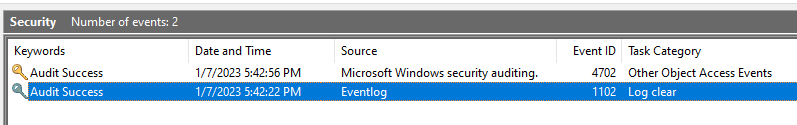

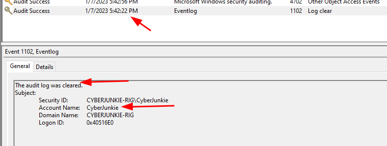

`1102` est particulièrement important car le journal Security contient notamment :

- authentifications ;
- account management ;
- privilege use ;
- process creation ;
- autres événements d’audit.

#### Informations utiles

L’événement permet notamment d’identifier :

- timestamp ;
- compte ayant effectué l’action ;
- domaine ;
- SID.

```text
1102
→ Security Log Cleared
→ Who?
→ When?
→ Investigate Account
```


Si le compte ayant effacé le journal est inattendu :

```text
1102
+
Unexpected Admin Account
+
Incident Time Window
→ High-Priority Investigation
```


### Pourquoi 1102 est très suspect

L’effacement du Security Log est une activité relativement rare sur un endpoint classique.

```text
Normal Administration?
ou
Defense Evasion?
```


Il faut immédiatement rechercher l’activité du compte concerné :

```text
Who cleared the log?
        ↓
Recent 4624 / 4648
        ↓
4720 / 4732?
        ↓
4688?
        ↓
Other suspicious activity?
```


Exemple :

```text
4720
→ New account created

4732
→ Added to Administrators

1102
→ Security log cleared
```


→ séquence très suspecte.

### Autres journaux effacés — Event ID 104

```text
Windows Logs
→ System
→ Provider : Microsoft-Windows-Eventlog
→ Event ID 104
→ The <log name> file was cleared
```


- Toute suppression d'un journal d'événements autre que le journal de sécurité sera enregistrée dans le journal système avec l'ID d'événement 104.

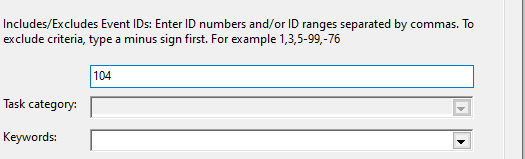

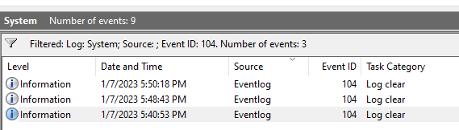

Exemples :

```text
System
PowerShell/Operational
Microsoft Office Alerts
```


#### Exemple

```text
Event ID 104

The System log file was cleared.
```


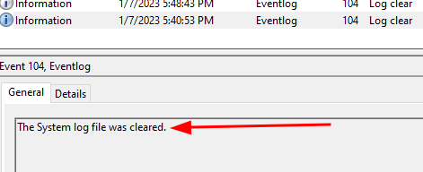

ou :

```text
Event ID 104

The Microsoft-Windows-PowerShell/Operational log file was cleared.
```


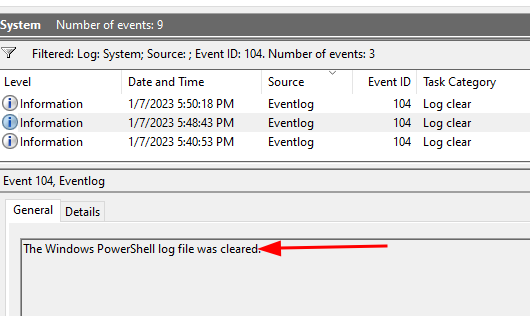

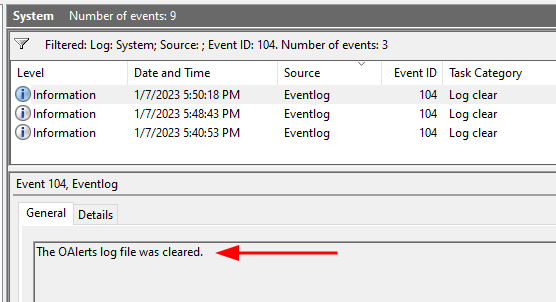

Cela permet de savoir **quel journal a été supprimé**.

### 1102 vs 104

```text
Security Log cleared
→ Security / 1102

Other Event Log cleared
→ System / 104
```


| Action | Event ID | Journal |
|---|---:|---|
| Security Log effacé | **1102** | Security |
| Autre Event Log effacé | **104** | System |

### Exemple d’investigation

```text
14:02
4688
→ powershell.exe

14:04
PowerShell activity

14:07
104
→ PowerShell/Operational cleared

14:08
1102
→ Security Log cleared
```


→ possible tentative de **Defense Evasion / Anti-Forensics**.

## Arrêt de la journalisation : 1100

### Arrêt du service Windows Event Log

Les attaquants peuvent également essayer de stopper :

```text
Windows Event Log
```


Service :

```text
eventlog
```


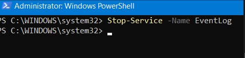

Objectif :

```text
Stop Event Logging
→ Future Windows Event Log visibility ↓
```


Cette action nécessite normalement des privilèges élevés.

### Event ID 1100 — Event Logging Service Shut Down

```text
Security
→ Event ID 1100
→ The event logging service has shut down
```


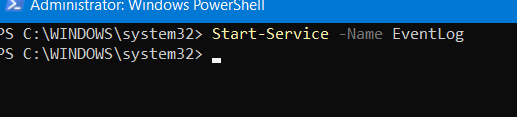

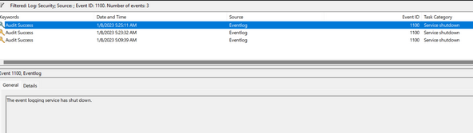

Cet événement peut être généré lorsque le service Windows Event Log s’arrête.

```text
Event Log Service
→ Shutdown
→ 1100
```


Il est intéressant pour le SOC car il peut précéder une perte de visibilité.

#### ⚠️ Correction importante

Le cours affirme que `1100` n’est pas généré lorsque le système s’éteint.

Ce n’est pas une règle fiable :

```text
1100
→ peut également apparaître lors d'un arrêt/reboot légitime
```


Il faut donc corréler avec des événements de shutdown/restart tels que :

```text
1074
6005
6006
6008
```


Ainsi :

```text
1100
+
Normal Shutdown Context
→ probablement légitime
```


alors que :

```text
1100
+
No Expected Shutdown
+
Suspicious Admin Activity
→ Possible Logging Tampering
```


## Arrêt du service ≠ disparition de toute télémétrie

Lorsque Windows Event Log est arrêté, la journalisation Windows classique est fortement impactée.

Mais cela ne signifie pas nécessairement :

```text
"Plus aucune télémétrie de sécurité"
```


D’autres sources peuvent continuer à exister :

- EDR telemetry ;
- network logs ;
- firewall ;
- proxy ;
- IDS / NDR ;
- cloud logs ;
- logs déjà centralisés.

```text
Endpoint Logs Lost
≠
All Evidence Lost
```


## Importance de la centralisation des logs

C’est précisément pourquoi il faut exporter les événements hors de l’endpoint.

```text
Endpoint
→ WEF / Agent
→ SIEM
```


Si l’attaquant efface ensuite les journaux locaux :

```text
Local EVTX
→ Deleted

Previously forwarded events
→ Still available in SIEM
```


> À condition évidemment que la collecte centralisée ait réellement fonctionné avant l’effacement.

## WEF / SIEM comme protection

```text
Endpoint A
Endpoint B
Endpoint C
      ↓
Windows Event Forwarding / Agent
      ↓
Central Collector / SIEM
```


Avantages :

- copie off-host ;
- investigation même après log clearing ;
- corrélation entre plusieurs machines ;
- alerting sur `1102`, `104`, `1100`.

## Détection SOC

### Security Log Cleared

```text
1102
→ Alert
→ Identify Account
→ Investigate Host
```


Priorité élevée si :

- endpoint critique ;
- compte inconnu ;
- activité pendant incident ;
- privilèges récemment acquis.

### Multiple Logs Cleared

```text
104
→ PowerShell log cleared

104
→ System log cleared

1102
→ Security log cleared
```


→ pattern particulièrement suspect.

### Logging Service Stopped

```text
1100
+
No maintenance / reboot
→ Investigate
```


## Corrélation avec Process Creation

Si l’audit Process Creation est disponible avant l’effacement :

```text
4688
→ wevtutil.exe

CommandLine:
wevtutil.exe cl Security
```


puis :

```text
1102
→ Security log cleared
```


la relation devient beaucoup plus forte :

```text
4688
→ wevtutil.exe cl Security

1102
→ Audit log cleared

→ Confirmed log-clearing activity
```


## Outils pouvant apparaître

Exemples d’outils légitimes pouvant être abusés :

```text
wevtutil.exe
PowerShell
Event Viewer
```


Conceptuellement :

```text
Legitimate Tool
+
Malicious Intent
→ LOLBin / Native Tool Abuse
```


## Pourquoi les attaquants ne suppriment pas toujours les logs

Effacer les logs présente aussi des risques pour l’attaquant.

### Besoin de privilèges

```text
Standard User
→ généralement insuffisant

Admin / SYSTEM
→ nécessaire pour de nombreuses manipulations
```


### Activité très visible

```text
1102 / 104 / 1100
→ High-Signal Events
```


Un attaquant peut donc préférer :

```text
Blend into normal activity
```


plutôt que :

```text
Clear everything
→ immediately attract SOC attention
```


### Logs déjà exportés

```text
Attack activity
→ SIEM ingestion

Attacker later clears endpoint
→ SIEM copy remains
```


Donc l’effacement local n’annule pas nécessairement les traces déjà collectées.

## Anti-Forensics / Defense Evasion

La manipulation des logs relève principalement de :

```text
Defense Evasion
```


et notamment :

```text
T1070.001
→ Clear Windows Event Logs
```


L’arrêt ou la perturbation des mécanismes de journalisation peut également s’inscrire dans :

```text
T1562.001
→ Impair Defenses
```


## Pattern d’attaque complet

```text
4624
→ Attacker logs in

4720
→ Creates persistence account

4732
→ Adds account to Administrators

4688
→ Executes malicious tools

104
→ Clears PowerShell logs

1102
→ Clears Security log

1100
→ Logging service stopped
```


→ reconstruction possible d’une séquence de **Privilege + Persistence + Defense Evasion**.

## Vue d’ensemble (manipulation des journaux)

```text
Event Log Manipulation
│
├─ 1102
│  → Security audit log cleared
│
├─ 104
│  → Another Event Log cleared
│
└─ 1100
   → Event Logging service shut down
```


Pour le SOC :

```text
1102 / 104 / 1100
        ↓
Validate Context
        ↓
Who performed it?
        ↓
Was there a shutdown?
        ↓
What happened before?
        ↓
Check SIEM / EDR / Network telemetry
        ↓
Determine Defense Evasion
```


Le point important est qu’un attaquant peut supprimer des **preuves locales**, mais pas nécessairement les copies déjà centralisées. C’est pourquoi la combinaison **off-host logging + SIEM + alerting sur les événements de manipulation** est essentielle pour conserver de la visibilité même lorsqu’un endpoint est fortement compromis.

Source des captures : [Hack The Box Academy - Event Log Analysis](https://academy.hackthebox.com/course/preview/event-log-analysis)
