Source des captures : [Hack The Box Academy - Event Log Analysis](https://academy.hackthebox.com/course/preview/event-log-analysis)

## Journaux d’événements du Pare-feu Windows

- **Windows Defender Firewall** contrôle le trafic réseau :
    - entrant ;
    - sortant ;
    - par application/service ;
    - protocole ;
    - port ;
    - adresse IP ;
    - profil réseau.

```text
Network Traffic
→ Windows Defender Firewall
→ Rule Evaluation
→ Allow / Block
```


Les logs du firewall peuvent aider à détecter :

- port scanning ;
- lateral movement ;
- communications C2 ;
- exfiltration ;
- modification des règles de sécurité ;
- désactivation du firewall.

### Intérêt SOC / DFIR

La télémétrie firewall endpoint complète d’autres sources :

```text
Windows Firewall
+
Network Firewall
+
NetFlow
+
Proxy
+
IDS / NDR
→ Better Network Visibility
```


Le firewall Windows peut également journaliser les **dropped packets**, ce qui peut révéler :

- scans ;
- tentatives de connexion ;
- accès bloqués ;
- communications vers des services non autorisés.

Les logs d’un firewall réseau, NetFlow ou NDR donnent souvent une meilleure visibilité globale, mais le firewall local apporte le contexte directement lié à l’endpoint.

## C2 et Firewall

Un firewall peut limiter les communications C2 :

### Trafic entrant

```text
Attacker / C2
→ Incoming Connection
→ Firewall
→ Block
```


### Trafic sortant

```text
Compromised Host
→ C2 Server
→ Outbound Firewall Rule
→ Block
```


Le contrôle **egress** est particulièrement important :

```text
Malware Execution
≠ Successful C2
```


si les communications sortantes nécessaires sont bloquées.

## Altération du firewall par un attaquant

Une fois suffisamment privilégié, un attaquant peut :

- créer une règle ;
- modifier une règle existante ;
- ouvrir un port ;
- autoriser un programme ;
- autoriser une destination ;
- désactiver le firewall.

Objectifs possibles :

```text
Persistence
Command & Control
Lateral Movement
Data Exfiltration
Defense Evasion
```


MITRE ATT&CK :

```text
T1562.004
→ Impair Defenses: Disable or Modify System Firewall
```


### IP Spoofing

Un attaquant peut tenter d’usurper l’IP d’un hôte autorisé pour tromper un firewall.

C’est possible dans certains scénarios, mais :

```text
Spoofed Source IP
≠ automatic firewall bypass
```


Pour une connexion TCP classique :

```text
SYN → Target
SYN/ACK → Spoofed Host
```


L’attaquant ne reçoit normalement pas la réponse et ne peut donc pas terminer le handshake.

L’IP spoofing est surtout pertinent dans certains contextes :

- trafic UDP/stateless ;
- attaques aveugles particulières ;
- attaquant on-path ;
- réseau local permettant d’intercepter/rerouter les réponses.

## Où chercher : journal du Windows Firewall

Les événements étudiés se trouvent dans :

```text
Applications and Services Logs
→ Microsoft
→ Windows
→ Windows Firewall With Advanced Security
→ Firewall
```


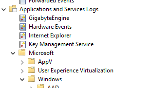

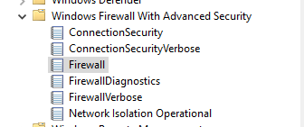

Les Event IDs importants de cette section :

```text
2004 → Rule Added
2005 → Rule Modified
2003 → Firewall Setting Changed
```


Vue d’ensemble, étape par étape :

| Étape | Source | Event ID / trace |
|---|---|---|
| Ajout d’une règle | Windows Firewall With Advanced Security / Firewall | **2004** — Rule Added |
| Modification d’une règle | Windows Firewall With Advanced Security / Firewall | **2005** — Rule Modified |
| Paramètre global (désactivation / réactivation) | Windows Firewall With Advanced Security / Firewall | **2003** — Firewall Setting Changed |
| Trafic autorisé / refusé | `pfirewall.log` (si la journalisation est configurée) | `ALLOW` / `DROP` |

## Event ID 2004 — Firewall Rule Added

```text
Windows Firewall With Advanced Security
→ Firewall
→ Event ID 2004
→ Firewall Rule Added
```


- Généré lorsqu’une nouvelle règle est ajoutée.

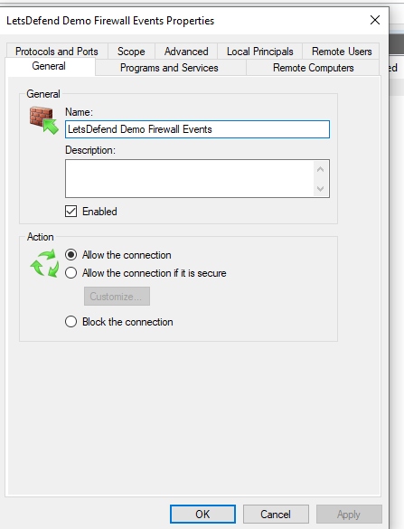

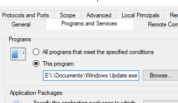

L’événement peut fournir notamment :

- Rule Name ;
- Rule ID ;
- direction ;
- Enabled ;
- protocol ;
- application ;
- ports ;
- modifying user ;
- modifying application.

```text
2004
→ New Firewall Rule
→ Who?
→ What?
→ Which Direction?
→ Which Program / Port?
```


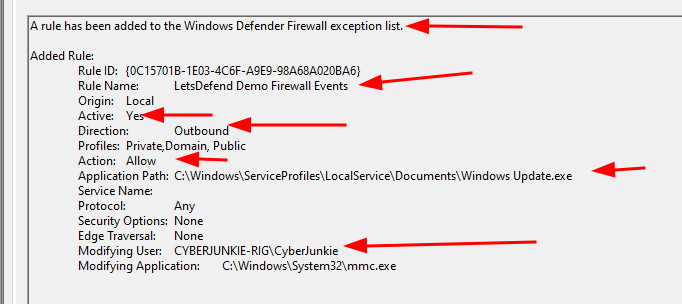

### Beaucoup de bruit légitime

Windows et les applications peuvent créer régulièrement des règles.

Par conséquent :

```text
Event 2004
≠ malicious by itself
```


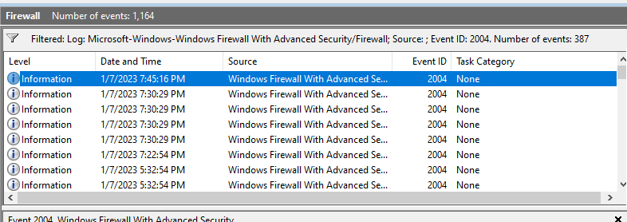

Il faut contextualiser :

```text
2004
+
Incident Time Window
+
Unexpected Application
+
Suspicious Port
+
Unexpected User
→ Interesting
```


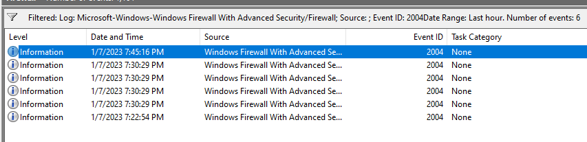

### SYSTEM n’est pas automatiquement légitime

De nombreuses règles légitimes sont créées par :

```text
NT AUTHORITY\SYSTEM
```


mais :

```text
SYSTEM
≠ Trusted Activity
```


Un attaquant avec des privilèges élevés peut également agir sous `SYSTEM`.

Toujours regarder :

- application concernée ;
- modifying process ;
- ports ;
- protocol ;
- direction ;
- adresse distante ;
- timing.

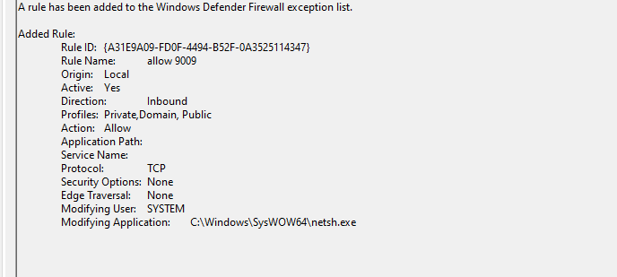

### Direction de la règle

#### Inbound

```text
Direction = Inbound
```


Peut permettre à un service d’accepter des connexions entrantes.

Exemple suspect :

```text
New Inbound Rule
+
TCP 4444
+
Unknown Executable
→ Investigate
```


#### Outbound

```text
Direction = Outbound
```


Peut permettre à un programme d’établir des connexions externes.

Exemple :

```text
Unknown Executable
+
Outbound Allow Rule
+
Internet Destination
→ Possible C2 / Exfiltration
```


Une règle outbound n’implique pas forcément du C2 : elle indique uniquement que ce trafic est autorisé selon les critères de la règle.

### Analyse du chemin de l’application

Un champ essentiel est le programme auquel la règle s’applique.

Exemple :

```text
C:\Users\CyberJunkie\Documents\Windows Update.exe
```


Pour un binaire prétendant appartenir à Windows :

```text
Windows-looking Name
+
User-writable Directory
→ Suspicious
```


Répertoires intéressants :

```text
%TEMP%
%APPDATA%
%LOCALAPPDATA%
Downloads
Documents
C:\Users\Public
```


### Modifying Application

Le champ **Modifying Application** permet d’identifier quel processus a apporté le changement.

Exemples intéressants :

```text
mmc.exe
powershell.exe
cmd.exe
netsh.exe
```


Cela peut indiquer :

```text
Human Administrative Action
ou
Script / Tool Execution
```


Mais : `PowerShell`, `cmd` ou `MMC` ne sont pas malveillants par nature. Ils deviennent intéressants lorsqu’ils sont corrélés à une modification inattendue.

### Corrélation avec Event ID 4688

Si Process Creation auditing est actif :

```text
4688
→ powershell.exe

puis

2004
→ Firewall Rule Added
```


cela permet de relier :

```text
Process Execution
→ Configuration Change
```


Exemple :

```text
4688
powershell.exe / netsh.exe

↓ shortly after

2004
Outbound Allow Rule
for suspicious.exe
```


→ pattern beaucoup plus significatif.

## Event ID 2005 — Firewall Rule Modified

```text
Windows Firewall With Advanced Security
→ Firewall
→ Event ID 2005
→ Firewall Rule Modified
```


- Généré lorsqu’une règle existante est modifiée.

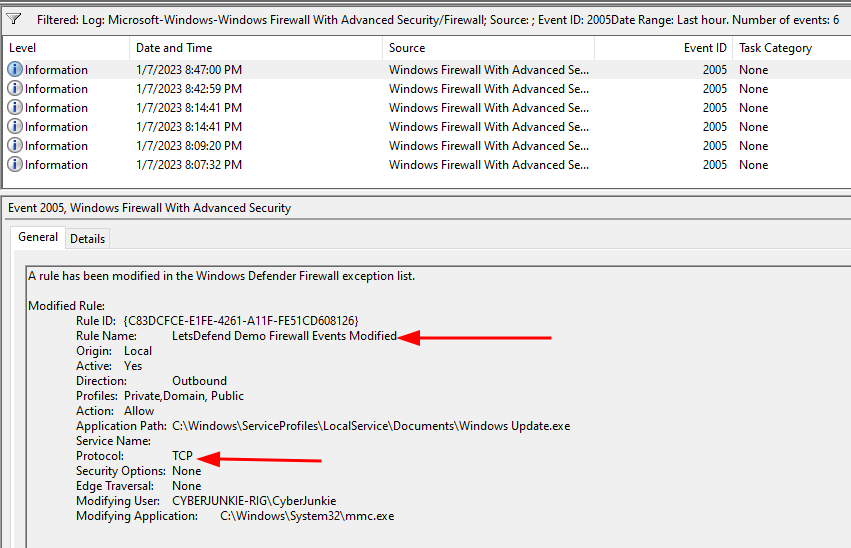

Un attaquant peut préférer modifier une règle légitime plutôt que d’en créer une nouvelle :

```text
Existing Legitimate Rule
        ↓
Modify Program / Port / Protocol
        ↓
Malicious Traffic Allowed
```


Avantage pour l’attaquant :

```text
Less obvious than new rule creation
```


### Que comparer ?

Pour un événement `2005`, vérifier les différences concernant :

- Rule Name ;
- application ;
- protocol ;
- local/remote ports ;
- direction ;
- enabled state ;
- remote addresses.

Exemple :

```text
Before:
Any protocol

After:
TCP only
```


ou :

```text
Before:
C:\Program Files\LegitApp\app.exe

After:
C:\Users\Public\implant.exe
```


→ très suspect.

### Rule ID

Le **Rule ID** permet de suivre une règle même si son nom change.

```text
Rule Name
→ can change

Rule ID
→ stable identifier
```


Workflow utile :

```text
2005
→ Modified Rule
→ Extract Rule ID
→ Search previous 2004 / 2005
→ Reconstruct original configuration
```


Cela aide à déterminer exactement ce que l’attaquant a modifié.

### Exemple de timeline

```text
14:12
2004
→ Rule "Windows Update" created

14:15
2005
→ Protocol changed

14:18
Network telemetry
→ suspicious outbound connection
```


On peut reconstruire :

```text
Firewall Change
→ Network Access Enabled
→ C2 Communication
```


## Event ID 2003 — Firewall Setting Changed

```text
Windows Firewall With Advanced Security
→ Firewall
→ Event ID 2003
→ Firewall Setting Changed
```


- Généré par les changements de configuration globale du firewall.

Pour détecter sa désactivation, rechercher notamment :

```text
Setting:
Enable Windows Defender Firewall

Value:
No
```


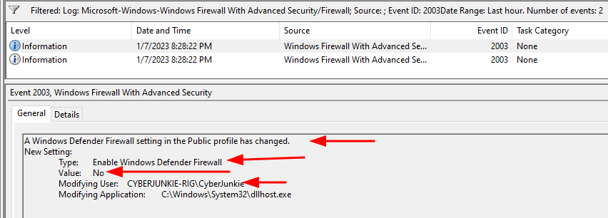

Conceptuellement :

```text
2003
→ Firewall Setting Changed
→ Enable Firewall = No
→ Firewall Disabled
```


### Désactivation du firewall

Une désactivation complète est particulièrement visible :

```text
Firewall Enabled
→ Disabled
→ Network Restrictions Reduced
```


Un tel événement pendant une fenêtre d’incident doit être investigué immédiatement.

Rechercher :

- utilisateur ayant effectué l’action ;
- modifying application ;
- privilèges obtenus récemment ;
- activité réseau après la désactivation.

### Réactivation

Une valeur :

```text
Enable Windows Defender Firewall
→ Yes
```


indique que le firewall a été réactivé.

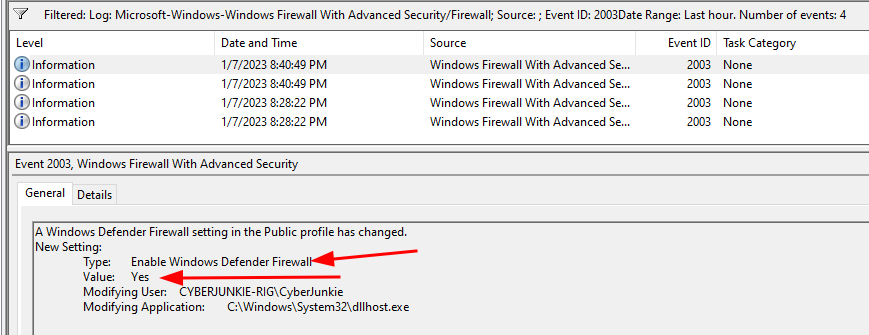

Une séquence comme :

```text
2003 → Firewall Disabled

Malicious Activity

2003 → Firewall Enabled
```


peut être particulièrement intéressante :

```text
Temporary Defense Evasion
→ Perform Attack
→ Restore Setting
```


### Désactivation vs modification de règles

Un attaquant discret peut préférer :

```text
Modify one firewall rule
```


plutôt que :

```text
Disable entire firewall
```


car :

```text
Full Disable
→ High Signal

Single Rule Change
→ Can blend into normal activity
```


## Dropped Packets

Le Windows Firewall peut également produire des logs de trafic autorisé/refusé lorsqu’il est configuré pour cela.

Chemin typique du fichier :

```text
%SystemRoot%\System32\LogFiles\Firewall\pfirewall.log
```


On peut y retrouver selon configuration :

- date/time ;
- action `ALLOW` / `DROP` ;
- protocol ;
- source IP ;
- destination IP ;
- source port ;
- destination port.

Exemple conceptuel :

```text
DROP TCP
10.0.10.5:51234
→ 10.0.10.20:445
```


Des tentatives répétées vers plusieurs hosts :

```text
HOST-A
→ TCP/445 HOST-B
→ TCP/445 HOST-C
→ TCP/445 HOST-D
```


peuvent évoquer :

```text
Scanning / Lateral Movement
```


## Détection de C2

Une seule connexion externe n’est pas suffisante.

Chercher plutôt des patterns comme :

```text
Repeated Connections
+
Same Destination
+
Regular Interval
+
Unknown Process
→ Possible Beaconing
```


Exemple :

```text
10:00 → 185.x.x.x:443
10:05 → 185.x.x.x:443
10:10 → 185.x.x.x:443
10:15 → 185.x.x.x:443
```


→ possible C2 beaconing.

### DNS et exfiltration

Une nouvelle règle UDP peut évoquer de l’exfiltration DNS.

Possible, mais :

```text
UDP Rule
≠ DNS Exfiltration
```


Pour suspecter du DNS tunneling / exfiltration, rechercher plutôt :

- UDP/TCP 53 ;
- domaines très longs ;
- forte entropie ;
- volumes inhabituels ;
- nombreuses requêtes ;
- destinations DNS non approuvées.

```text
UDP/53
+
Long Encoded Subdomains
+
High Frequency
→ Possible DNS Tunneling
```


## Corrélation SOC (pare-feu)

### Règle C2 ajoutée

```text
4688
→ powershell.exe

2004
→ Outbound rule added

EDR
→ unknown.exe executed

Network
→ external connection
```


→ possible :

```text
Execution
→ Firewall Modification
→ C2
```


### Règle existante détournée

```text
2005
→ Existing rule modified
→ Program changed to implant.exe

Network Traffic
→ implant.exe connects externally
```


→ forte suspicion.

### Firewall désactivé

```text
2003
→ Firewall = No

+
Unexpected Admin Activity
+
Network Connections
→ Defense Evasion
```


## Vue d’ensemble (pare-feu)

```text
Windows Firewall Events
│
├─ 2004
│  → Rule Added
│
├─ 2005
│  → Rule Modified
│
└─ 2003
   → Firewall Setting Changed
```


À analyser avec :

```text
Rule Name
Rule ID
Direction
Protocol
Ports
Program
Remote Address
Modifying User
Modifying Application
Timestamp
```


Workflow SOC :

```text
Firewall Event
        ↓
Identify Change
        ↓
Who made it?
        ↓
Which process?
        ↓
Which application / port?
        ↓
Was it expected?
        ↓
Correlate with 4688 + EDR + Network Logs
```


Le point essentiel est que la création ou modification d’une règle n’est pas malveillante en soi. Ce sont surtout le processus ayant effectué le changement, le programme autorisé, les ports/protocoles, la direction, le contexte temporel et la télémétrie réseau associée qui permettent d’identifier un éventuel `C2`, `lateral movement`, `exfiltration` ou mécanisme de `Defense Evasion`.

Source des captures : [Hack The Box Academy - Event Log Analysis](https://academy.hackthebox.com/course/preview/event-log-analysis)
