Source des captures : [Hack The Box Academy - Event Log Analysis](https://academy.hackthebox.com/course/preview/event-log-analysis)

## Journaux d’événements de Windows Defender

- **Microsoft Defender Antivirus** est l’antivirus natif de Windows.
- Il fournit notamment :
    - Real-Time Protection ;
    - détection de malware ;
    - scans à la demande ;
    - quarantaine / suppression ;
    - protection basée sur signatures et détections comportementales.

Les logs Defender sont particulièrement utiles pour :

- retrouver des détections historiques ;
- identifier les outils utilisés par un attaquant ;
- vérifier si une menace a réellement été neutralisée ;
- détecter une tentative de désactivation de Defender ;
- rechercher des exclusions ajoutées par un attaquant.

```text
Malware Activity
→ Defender Detection
→ Event Logs
→ SOC / IR Investigation
```


## Où chercher : emplacement des logs Defender

Les événements étudiés se trouvent dans :

```text
Applications and Services Logs
→ Microsoft
→ Windows
→ Windows Defender
→ Operational
```


Event IDs principaux de cette section :

```text
1116 → Malware detected
1117 → Action taken on malware
5001 → Real-time protection disabled
5007 → Defender configuration changed
```


Vue d’ensemble, étape par étape :

| Étape | Event ID (Windows Defender/Operational) |
|---|---|
| Détection | **1116** — Malware detected |
| Remédiation | **1117** — Action taken (quarantine, remove, clean…) |
| Altération : protection désactivée | **5001** — Real-time protection disabled |
| Altération : configuration, exclusions | **5007** — Configuration changed (`Exclusions\Paths`) |

## Détection et remédiation : 1116 et 1117

### Event ID 1116 — Malware Detected

```text
Windows Defender/Operational
→ Event ID 1116
→ Malware Detected
```


- Généré lorsqu’un malware ou fichier suspect est détecté.

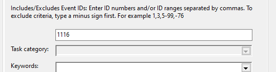

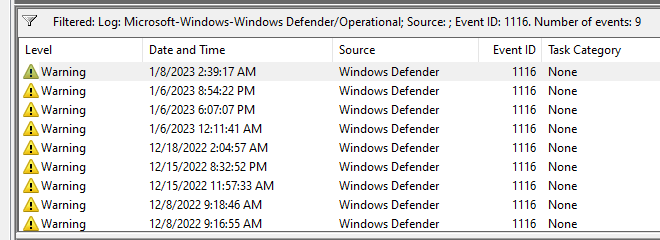

L’événement peut fournir :

- timestamp ;
- threat name ;
- severity ;
- category ;
- path ;
- process associé à la détection.

```text
1116
→ Threat Detected
→ What?
→ Where?
→ Which Process?
→ When?
```


#### Informations intéressantes

Exemple conceptuel :

```text
Threat:
Trojan:Win32/Example

Path:
C:\Users\user\Downloads\payload.exe

Process:
C:\Windows\explorer.exe
```


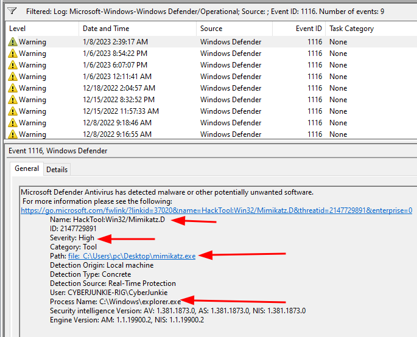

Le `Process Name` peut aider à déterminer quel processus était impliqué lorsque Defender a détecté la menace.

Exemples du cours :

```text
explorer.exe
→ fichier déplacé/copied via Explorer

cmd.exe
→ fichier copié/manipulé via CMD
```


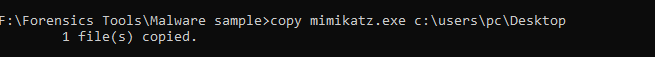

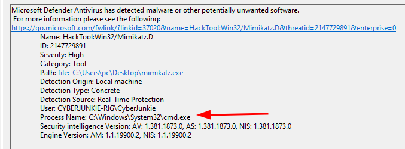

Le processus indiqué n’est pas forcément « le malware parent » ni la preuve qu’il a installé le malware. Il fournit surtout du contexte sur l’opération ayant déclenché la détection.

#### Analyse SOC d’un 1116

Ne pas regarder uniquement le nom de menace.

Corréler :

```text
Threat Name
+
File Path
+
Process
+
User
+
Timestamp
+
Other Events
→ Context
```


Exemple :

```text
1116
→ Mimikatz detected

4688
→ powershell.exe

4624
→ Privileged Logon

→ Possible Credential Access Activity
```


#### Defender et évolution des signatures

Un malware peut :

```text
Day 1
→ Not detected

Day 5
→ Signature / Cloud Detection updated

Day 5
→ Detected
```


Donc :

```text
Not Detected Earlier
≠ Benign
```


Un fichier ayant fonctionné auparavant peut être détecté plus tard lorsque :

- signatures mises à jour ;
- heuristics améliorées ;
- réputation cloud modifiée ;
- détection comportementale enrichie.

### Event ID 1117 — Action Taken

```text
Windows Defender/Operational
→ Event ID 1117
→ Action Taken
```


- Après détection, Defender peut effectuer une action.

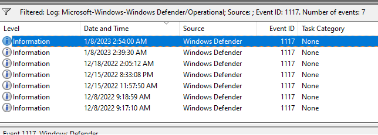

Actions possibles :

- quarantine ;
- remove ;
- clean ;
- allow ;
- block selon configuration.

```text
1116
→ Threat Detected

1117
→ Remediation Action
```


#### Champs intéressants

Examiner notamment :

- threat name ;
- path ;
- action ;
- error / result ;
- status.

```text
Threat
→ Action
→ Successful?
```


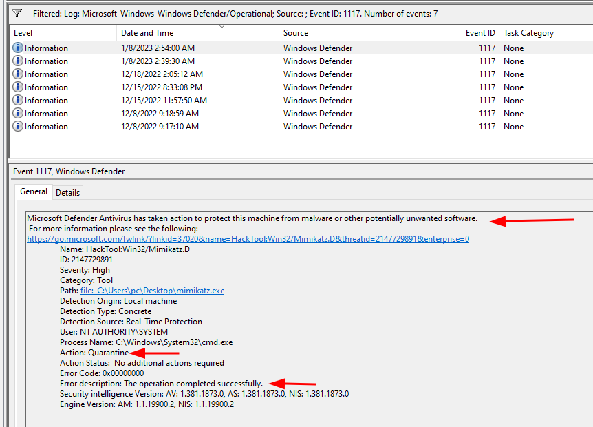

Exemple :

```text
Action:
Quarantine

Result:
Success
```


→ le malware a été détecté et l’action a réussi.

Mais :

```text
Action:
Remove

Result:
Failed
```


→ le fichier peut toujours être présent ou nécessiter une investigation supplémentaire.

#### Détection ≠ Neutralisation

Très important :

```text
1116
≠ Threat Removed
```


Il faut vérifier :

```text
1116
→ Detection

1117
→ Remediation
→ Success / Failure
```


Puis éventuellement :

```text
File Still Present?
Process Still Running?
Persistence Present?
Other Hosts Affected?
```


## Altération de Defender : 5001, exclusions et 5007

### Event ID 5001 — Real-Time Protection Disabled

```text
Windows Defender/Operational
→ Event ID 5001
→ Real-Time Protection Disabled
```


- La **Real-Time Protection** analyse en continu l’activité et les fichiers.
- Cet événement est généré lorsqu’elle est désactivée.

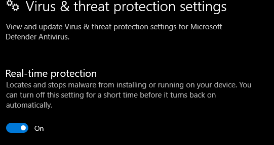

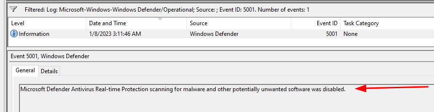

Dans un environnement d’entreprise, cet événement est généralement très intéressant.

#### Pourquoi un attaquant désactive la Real-Time Protection

Objectif :

```text
Disable Defender RTP
→ Transfer Tools
→ Execute Malware
→ Lower Detection Chance
```


Peut permettre à l’attaquant de :

- déposer des payloads ;
- exécuter des outils offensifs ;
- lancer des scripts ;
- effectuer credential dumping ;
- réduire les interruptions par l’antivirus.

#### Corrélation d’un 5001

Exemple :

```text
14:03 → 5001
Defender RTP disabled

14:05 → 4688
powershell.exe

14:07 → suspicious.exe executed

14:08 → outbound connection
```


→ possible séquence :

```text
Defense Evasion
→ Execution
→ C2
```


#### ⚠️ 5001 doit être contextualisé

Un `5001` peut aussi résulter de :

- administration légitime ;
- troubleshooting ;
- déploiement de sécurité ;
- interaction avec un autre antivirus.

Donc :

```text
5001
+
Unexpected Admin Activity
+
Incident Time Window
→ High Suspicion
```


### Exclusions Defender

Un attaquant peut éviter de désactiver complètement Defender et ajouter une exclusion.

Exemples :

```text
Exclude:
C:\Users\Public\Tools\

ou

C:\Users\user\
```


Conséquence :

```text
Defender Active
+
Excluded Path
→ Files inside path may not be scanned normally
```


Cette technique est souvent plus discrète qu’une désactivation complète.

### Event ID 5007 — Configuration Changed

```text
Windows Defender/Operational
→ Event ID 5007
→ Configuration Changed
```


- Généré par les changements de configuration Defender.

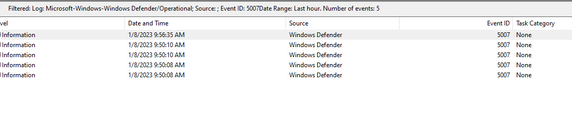

Mais :

```text
5007
≠ exclusion specifically
```


`5007` signifie plus largement :

```text
Microsoft Defender Antivirus configuration has changed
```


Il peut donc générer beaucoup de bruit.

#### Détecter une exclusion avec 5007

Dans la description de l’événement, rechercher notamment :

```text
HKLM\SOFTWARE\Microsoft\Windows Defender\Exclusions\Paths\
```


Exemple :

```text
HKLM\SOFTWARE\Microsoft\Windows Defender\Exclusions\Paths\
C:\Users\pc\Desktop\CyberJunkie's APT Tools
```


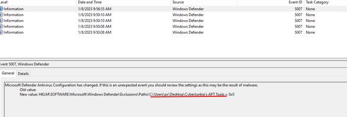

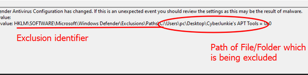

Interprétation :

```text
5007
+
Exclusions\Paths
→ Defender Exclusion Changed
```


#### Pourquoi les exclusions sont importantes

Un attaquant peut :

```text
Create Exclusion
        ↓
Drop Tools into Excluded Path
        ↓
Execute Malware
        ↓
Defender visibility reduced
```


Exemples de chemins suspects :

```text
C:\Users\Public\Tools\
C:\Temp\
C:\Users\<user>\Downloads\
Entire User Profile
```


Plus l’exclusion est large, plus elle est intéressante.

#### Exclusion ciblée vs exclusion large

```text
Single known application path
→ peut être légitime
```


```text
C:\
ou
C:\Users\
ou
Entire user profile
→ Highly Suspicious
```


Surtout si elle apparaît pendant la fenêtre d’incident.

#### Mimikatz — nuance

Le cours utilise Mimikatz comme exemple d’outil pouvant être placé dans une exclusion Defender.

À retenir plus précisément :

```text
Mimikatz
→ Credential Access
→ T1003 OS Credential Dumping
```


Il peut notamment être utilisé pour extraire :

- NTLM hashes ;
- Kerberos material ;
- credentials/secrets en mémoire selon le contexte.

Le présenter uniquement comme un outil servant à « voler des tokens d’authentification » est trop réducteur. Son usage classique est surtout lié au credential dumping.

#### Event ID 5007 : bruit légitime

Comme `5007` couvre beaucoup de changements de configuration :

```text
Windows / Defender
→ legitimate configuration changes
→ 5007
```


Il faut réduire le bruit avec :

```text
Incident Time Window
+
Specific Registry Path
+
Change Details
```


Exemple :

```text
5007
+
Exclusions\Paths
+
C:\Users\Public\Tools
→ Investigate
```


## Corrélation recommandée (Defender)

### Exclusion puis malware

```text
5007
→ Exclusion added

4688
→ suspicious.exe executed from excluded path

Network Logs
→ outbound connection
```


→ possible :

```text
Defense Evasion
→ Execution
→ C2
```


### Defender désactivé puis malware

```text
5001
→ Real-Time Protection disabled

1116 absent afterward
+
EDR / Network detects suspicious activity
```


→ la baisse de visibilité antivirus devient elle-même un élément d’investigation.

### Malware détecté et supprimé

```text
1116
→ Malware detected

1117
→ Quarantined successfully
```


Puis vérifier :

```text
Persistence?
Other Copies?
Other Hosts?
Same Hash elsewhere?
```


## MITRE ATT&CK (Defender)

Les tentatives de désactivation ou modification de Defender correspondent notamment à :

```text
T1562.001
→ Impair Defenses
```


Les exclusions ou désactivations peuvent donc être vues comme de la :

```text
Defense Evasion
```


Mimikatz / credential dumping :

```text
T1003
→ OS Credential Dumping
```


## Patterns SOC importants (Defender)

### Malware détecté

```text
1116
+
Suspicious Path
+
Known Malicious Threat
→ Investigate
```


### Malware non neutralisé

```text
1116
+
1117
+
Remediation Failed
→ High Priority
```


### Defender désactivé

```text
5001
+
No Change Request
+
Incident Window
→ Possible Defense Evasion
```


### Exclusion suspecte

```text
5007
+
Exclusions\Paths
+
User-writable Directory
→ Suspicious
```


### Exclusion + exécution

```text
5007
→ C:\Users\Public\Tools excluded

4688
→ mimikatz.exe

4624 / 4672
→ privileged session

→ Possible Credential Access
```


## Vue d’ensemble (Defender)

```text
Windows Defender/Operational
│
├─ 1116
│  → Malware detected
│
├─ 1117
│  → Action taken
│
├─ 5001
│  → Real-Time Protection disabled
│
└─ 5007
   → Configuration changed
      └─ Exclusions\Paths → exclusion activity
```


Workflow d’investigation :

```text
Defender Event
      ↓
Detection / Configuration Change?
      ↓
Which File / Path / Process?
      ↓
Was Defender Disabled or Bypassed?
      ↓
Was Remediation Successful?
      ↓
Correlate with 4688 / Auth / Network / EDR
      ↓
Determine Impact
```


Le point important est de distinguer **détection**, **action de remédiation** et **altération de Defender** : `1116` indique qu’une menace a été détectée, `1117` permet de vérifier ce qui lui est arrivé, tandis que `5001` et `5007` peuvent révéler une tentative de **Defense Evasion** destinée à diminuer la visibilité de l’antivirus.

Source des captures : [Hack The Box Academy - Event Log Analysis](https://academy.hackthebox.com/course/preview/event-log-analysis)
