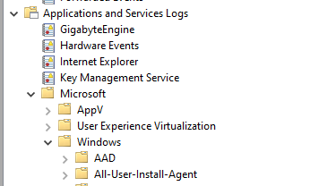
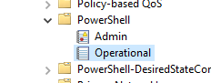
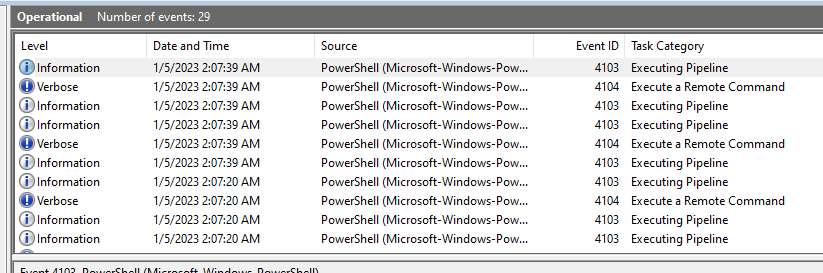
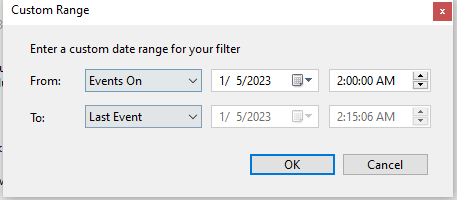
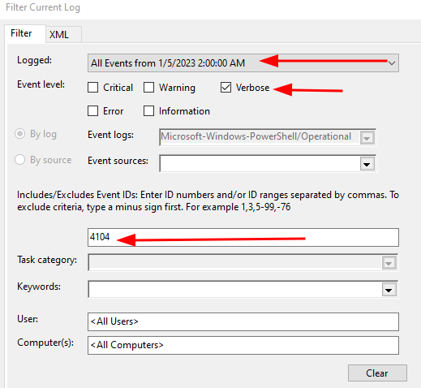
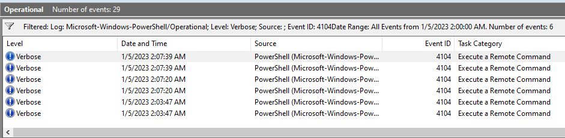
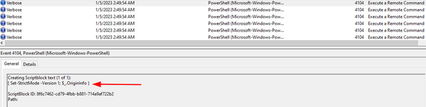
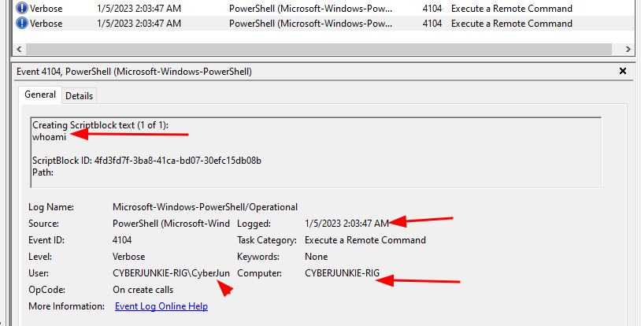
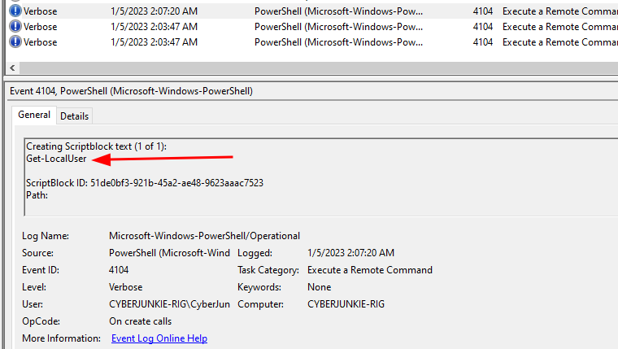
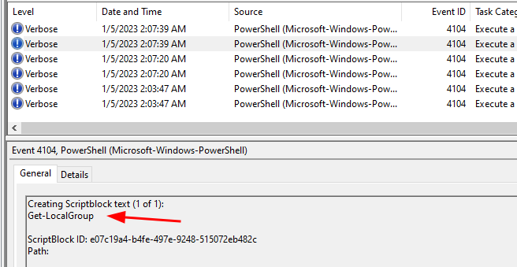

Source des captures : [Hack The Box Academy - Event Log Analysis](https://academy.hackthebox.com/course/preview/event-log-analysis)

## Journaux d’événements d’exécution PowerShell

- **PowerShell** est un outil d’administration très puissant intégré à Windows.
- Il peut être utilisé légitimement pour :
    - administration système ;
    - automation ;
    - Active Directory ;
    - gestion réseau ;
    - configuration de services / firewall.
- Les attaquants peuvent également l’utiliser pour :
    - reconnaissance / enumeration ;
    - télécharger ou exécuter du code ;
    - Defense Evasion ;
    - credential access ;
    - modifier Defender / firewall ;
    - établir une persistence ;
    - lancer des outils ou payloads.

```text
PowerShell
→ Legitimate Administration
ou
→ Living-off-the-Land / Post-Exploitation
```


> `powershell.exe` n’est pas malveillant en soi : c’est le **contenu exécuté + contexte + utilisateur + timeline** qui déterminent si l’activité est suspecte.

## Où chercher : emplacement des logs PowerShell

Les événements PowerShell étudiés se trouvent dans :

```text
Applications and Services Logs
→ Microsoft
→ Windows
→ PowerShell
→ Operational
```






Source particulièrement utile pour le SOC / DFIR :

```text
Microsoft-Windows-PowerShell/Operational
```




Vue d’ensemble :

| Ce qu’on cherche | Source | Condition |
|---|---|---|
| Contenu du code exécuté | PowerShell/Operational **4104** (Script Block Logging) | Script Block Logging activé (sinon visibilité partielle) |
| Cmdlets, paramètres, pipeline | PowerShell/Operational **4103** (Module Logging) | Module Logging activé |
| Commandes et sorties d’une session | PowerShell Transcription (fichiers texte) | Transcription activée |
| Lancement de `powershell.exe` | Security **4688** | Audit Process Creation activé |

## Script Block Logging : 4104

### Event ID 4104 — Script Block Logging

```text
Microsoft-Windows-PowerShell/Operational
→ Event ID 4104
→ PowerShell Script Block Logging
```


- L’Event ID principal de cette section.

Il peut enregistrer le **contenu du code PowerShell exécuté**.

Exemple :

```text
Creating Scriptblock text:

whoami
```


ou :

```powershell
Get-LocalUser
```


> ⚠️ Le point central de `4104` est le **Script Block Logging**. Le libellé de Task Category affiché par Event Viewer n’est pas ce qui définit réellement la signification de l’événement.

### Script Block

Un **script block** est une unité de code PowerShell.

Exemples :

```powershell
Get-LocalUser
```


```powershell
Get-Process | Where-Object {$_.Name -eq "lsass"}
```


```powershell
Invoke-WebRequest https://example.com/file.exe -OutFile file.exe
```


Lorsqu’il est journalisé :

```text
PowerShell Code
→ Script Block
→ Event 4104
→ Event Log
```


### Activation du Script Block Logging

Pour une visibilité complète, il est recommandé d’activer :

```text
PowerShell Script Block Logging
```


via GPO / configuration centralisée.

Chemin conceptuel :

```text
Administrative Templates
→ Windows Components
→ Windows PowerShell
→ Turn on PowerShell Script Block Logging
```


> Sans cette configuration, il ne faut pas supposer que **toutes les commandes PowerShell** seront nécessairement présentes dans les `4104`.

### Informations utiles dans un 4104

Un événement peut contenir notamment :

- contenu du script block ;
- `ScriptBlock ID` ;
- chemin du script si applicable ;
- timestamp ;
- contexte utilisateur / machine via les métadonnées de l’événement.

```text
4104
→ What code was executed?
→ When?
→ On which host?
→ Under which context?
```


### Filtrage

Pour réduire le bruit :

```text
Event ID = 4104
+
Incident Time Window
```


Exemple :

```text
05/01/2023
~02:02
```






```text
Thousands of PowerShell Events
        ↓
4104 + Time Window
        ↓
Relevant Script Blocks
```




Le filtrage temporel est particulièrement utile lorsqu’on connaît déjà :

- heure de l’alert EDR ;
- authentification suspecte ;
- exécution d’un malware ;
- fenêtre de compromission.



### Exemple : `whoami`

```powershell
whoami
```




Permet de déterminer :

```text
Current User / Security Context
```


Un attaquant peut l’utiliser immédiatement après un accès initial pour savoir :

- quel compte il contrôle ;
- quel niveau de privilèges il possède.

```text
Initial Access
→ whoami
→ Understand Current Context
```


### Exemple : `Get-LocalUser`

```powershell
Get-LocalUser
```




Permet d’énumérer les comptes locaux.

Utilité offensive possible :

```text
Get-LocalUser
→ Discover Accounts
→ Identify Admin / Service / Dormant Accounts
```


MITRE ATT&CK :

```text
T1087
→ Account Discovery
```


Plus précisément :

```text
T1087.001
→ Local Account
```


### Exemple : `Get-LocalGroup`

```powershell
Get-LocalGroup
```




Permet d’énumérer les groupes locaux.

Un attaquant peut chercher notamment :

```text
Administrators
Remote Desktop Users
Backup Operators
```


Objectifs :

- comprendre les privilèges présents ;
- identifier des groupes intéressants ;
- préparer Privilege Escalation / Lateral Movement.

MITRE ATT&CK :

```text
T1069
→ Permission Groups Discovery
```


### ⚠️ Ces commandes ne confirment pas une intrusion

Le cours conclut que :

```text
whoami
Get-LocalUser
Get-LocalGroup
→ intrusion confirmed
```


C’est trop catégorique.

Ces commandes sont également utilisées par :

- administrateurs ;
- scripts IT ;
- support ;
- troubleshooting ;
- outils d’inventaire.

Il faut plutôt raisonner ainsi :

```text
Discovery Commands
+
Unexpected User
+
Suspicious Login
+
Incident Time Window
+
Other Malicious Activity
→ Stronger Suspicion
```


Exemple :

```text
02:01 → 4624 suspicious RDP logon
02:02 → whoami
02:02 → Get-LocalUser
02:03 → Get-LocalGroup
02:05 → payload download
```


→ beaucoup plus significatif qu’un `Get-LocalUser` isolé.

### Reconnaissance post-exploitation

Après un foothold, un attaquant cherche souvent à comprendre l’environnement :

```text
Initial Access
      ↓
Host Discovery
      ↓
User / Group Discovery
      ↓
Privilege Discovery
      ↓
Network Discovery
      ↓
Lateral Movement
```


Commandes PowerShell possibles :

```powershell
Get-LocalUser
Get-LocalGroup
Get-Process
Get-Service
Get-NetTCPConnection
Get-ComputerInfo
```


Ces commandes peuvent former un **pattern de discovery** lorsqu’elles apparaissent rapidement après une compromission.

### Event ID 4104 et scripts malveillants

`4104` peut enregistrer bien plus qu’une simple commande interactive.

Exemples :

```powershell
Invoke-Expression ...
```


```powershell
Invoke-WebRequest ...
```


```powershell
IEX(...)
```


ou contenu :

- obfusqué ;
- Base64 ;
- downloader ;
- reconnaissance ;
- credential theft ;
- modification de défenses.

```text
4104
→ Actual PowerShell Content
→ High-Value DFIR Evidence
```


### Obfuscation

Les attaquants peuvent obfusquer les commandes :

```text
Readable Command
→ Encoding / String Manipulation
→ Obfuscated PowerShell
```


Exemples d’éléments intéressants :

```text
-EncodedCommand
IEX
Invoke-Expression
FromBase64String
DownloadString
Invoke-WebRequest
WebClient
```


> Obfuscation ≠ automatiquement malveillant, mais elle augmente fortement l’intérêt analytique dans un contexte suspect.

### Script Block fragmenté

Un long script peut être réparti sur plusieurs événements `4104`.

On peut rencontrer :

```text
MessageNumber
MessageTotal
ScriptBlockId
```


Exemple :

```text
Message 1 of 3
Message 2 of 3
Message 3 of 3
```


Il faut alors reconstruire les fragments partageant le même :

```text
ScriptBlockId
```


pour retrouver le script complet.

## Compléments : Module Logging (4103) et transcription

### Event ID 4103 — Module Logging

```text
Microsoft-Windows-PowerShell/Operational
→ Event ID 4103
→ PowerShell Module Logging
```


- Un autre Event ID important.

Peut enregistrer des informations détaillées sur :

- cmdlets ;
- paramètres ;
- pipeline ;
- modules exécutés.

```text
4103
→ What PowerShell operations occurred?

4104
→ What script/code was executed?
```


Les deux sont complémentaires.

### 4103 vs 4104

| Event ID | Utilité |
|---:|---|
| **4103** | Module / pipeline activity |
| **4104** | contenu des Script Blocks |

Pour une investigation PowerShell :

```text
4103
+
4104
→ Better Visibility
```


### PowerShell Transcription

Une autre fonctionnalité utile est :

```text
PowerShell Transcription
```


Elle peut enregistrer une transcription texte des sessions PowerShell :

- commandes ;
- sorties ;
- utilisateur ;
- heure ;
- machine.

```text
PowerShell Session
→ Transcript
→ Additional Investigation Evidence
```


À activer en complément de :

```text
Script Block Logging
+
Module Logging
```


## Corrélations

### Corrélation avec Event ID 4688

Si `Audit Process Creation` est activé :

```text
Security
→ Event ID 4688
→ Process Created
```


Exemple :

```text
4688
→ powershell.exe

4104
→ Invoke-WebRequest ...

Network
→ connection to external IP
```


On obtient :

```text
Process Creation
→ PowerShell Code
→ Network Activity
```


→ beaucoup plus robuste qu’un Event ID analysé seul.

### Exemple de timeline (PowerShell)

```text
02:01
4624
→ suspicious remote logon

02:02
4688
→ powershell.exe

02:02
4104
→ whoami

02:03
4104
→ Get-LocalUser

02:03
4104
→ Get-LocalGroup

02:05
4104
→ Invoke-WebRequest ...

02:06
EDR / Firewall
→ outbound connection
```


Interprétation possible :

```text
Initial Access
→ Discovery
→ Payload Retrieval
→ Further Execution
```


### PowerShell + Scheduled Tasks

PowerShell peut être combiné avec d’autres mécanismes déjà étudiés :

```text
4698
→ Scheduled Task Created

Task Action:
powershell.exe -File malicious.ps1
```


Puis :

```text
4104
→ malicious PowerShell script executed
```


Pattern :

```text
Scheduled Task
→ PowerShell
→ Persistence + Execution
```


### PowerShell + Defender

Exemple :

```text
4104
→ Defender configuration modification

5001 / 5007
→ Defender changed
```


Corrélation :

```text
PowerShell
→ Modify Defender
→ Defense Evasion
```


### PowerShell + Firewall

Exemple :

```text
4104
→ firewall configuration command

2004 / 2005
→ Firewall Rule Added / Modified
```


```text
PowerShell
→ Firewall Modification
→ Possible Defense Evasion / C2 Enablement
```


### PowerShell + Account Management

Exemple :

```text
4104
→ New-LocalUser ...

4720
→ Account Created

4732
→ Added to Administrators
```


→ permet de relier :

```text
Command
→ Resulting Windows Security Event
```


## AMSI

PowerShell est également intégré à :

```text
AMSI
→ Antimalware Scan Interface
```


AMSI permet aux produits de sécurité d’inspecter le contenu de scripts avant / pendant leur exécution.

```text
PowerShell Script
→ AMSI
→ Defender / Security Product
→ Inspection
```


Complémentaire à :

```text
4104 logging
EDR
Defender
```


## Patterns SOC intéressants (PowerShell)

### Enumeration après accès suspect

```text
4624 suspicious logon
+
4104 whoami
+
4104 Get-LocalUser
+
4104 Get-LocalGroup
→ Possible Post-Exploitation Discovery
```


### Download / Execution

```text
4104
+
Invoke-WebRequest / WebClient
+
External URL
→ Investigate
```


### Obfuscated PowerShell

```text
4104
+
Encoded / Obfuscated Content
+
Unexpected User
→ High Suspicion
```


### Defense Evasion

```text
4104
→ Security product modification

5001 / 5007 / 2003
→ Security control changed
```


## Vue d’ensemble (PowerShell)

```text
PowerShell Logging
│
├─ 4103
│  → Module Logging
│
├─ 4104
│  → Script Block Logging
│  → PowerShell code content
│
├─ Transcription
│  → Session command/output records
│
└─ 4688
   → powershell.exe process creation
   → if Process Creation auditing enabled
```


Workflow SOC :

```text
PowerShell Event
      ↓
Extract Script Block
      ↓
Identify User / Host / Time
      ↓
Benign Administration or Suspicious?
      ↓
Look for Discovery / Download / Defense Evasion
      ↓
Correlate with 4624 / 4688 / Defender / Firewall / Network
      ↓
Reconstruct Activity
```


Le point essentiel est que `4104` fournit souvent **le contenu PowerShell réellement exécuté**, ce qui en fait une source de très grande valeur en DFIR. Mais des commandes comme `whoami`, `Get-LocalUser` ou `Get-LocalGroup` ne suffisent pas à confirmer une intrusion : leur valeur vient de leur **corrélation avec l’utilisateur, le contexte d’authentification, la fenêtre temporelle et les autres actions observées sur l’endpoint**.

Source des captures : [Hack The Box Academy - Event Log Analysis](https://academy.hackthebox.com/course/preview/event-log-analysis)
